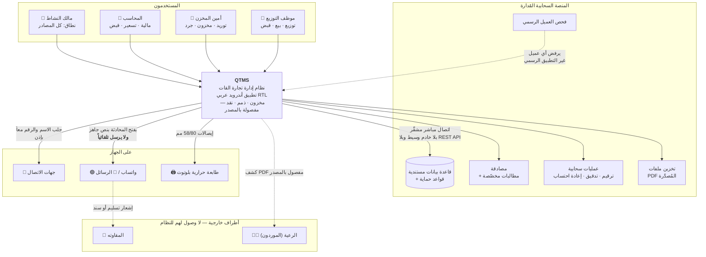

# C1 — مخطط سياق النظام (System Context)

| البند | القيمة |
|---|---|
| **الإلزامية** | **M** |
| **الطبيعة** | **LIVING** — يتغيّر عند إضافة/إزالة تكامل خارجي |
| **المالك** | المهندس المعماري (ARCH) |
| **المستوى** | **C1** — النظام ككل ضمن محيطه · الجمهور: **المالك وأصحاب المصلحة** |

---

## المخطط

---

## الأطراف والتفاعلات

| الطرف | نوعه | التفاعل | ملاحظة حاكمة |
|---|---|---|---|
| **مالك النشاط** | مستخدم | كل الصلاحيات · **الوحيد الذي يكتب الإعداد التأسيسي ويحدد نطاق المصادر ويرى سحبياته** | نطاق مصادره **«الكل» دائماً** |
| **المحاسب** | مستخدم | تسعير · ضريبة · قبض · خصم · إيداع بنكي · خرجيات · تقارير مالية | **بلا توزيع ولا توريد** |
| **أمين المخزن** | مستخدم | توريد عدداً وجواني · مخزون · تصريف متأخر · جرد | **بلا أي صلاحيات مالية** |
| **موظف التوزيع** | مستخدم | توزيع · بيع نقدي · قبض · إرسال | **قد يُخفى عنه عمود السعر كلياً** |
| **قاعدة البيانات المستندية** | نظام مُدار | **مصدر الحقيقة الوحيد** — مستندات · دفاتر · أرصدة · ملخصات | **قواعد الحماية هي طبقة التفويض الوحيدة** |
| **خدمة المصادقة** | نظام مُدار | جلسات · **ومطالبات تحمل الدور والصلاحيات ونطاق المصادر** | **كلمات المرور لا تُخزَّن في القاعدة إطلاقاً** |
| **العمليات السحابية** | نظام مُدار | الترقيم · **سجل التدقيق** · **إعادة الاحتساب** · الملخصات · المركز المعلّق | **ليست «خادماً خارجياً»** — جزء أصيل من المنصة |
| **تخزين الملفات** | نظام مُدار | حفظ PDF المُصدَّرة | — |
| **فحص العميل** | نظام مُدار | **رفض أي عميل غير التطبيق الرسمي** | طبقة تسبق قواعد الحماية |
| **جهات الاتصال** | خدمة جهاز | **جلب الاسم والرقم معاً بضغطة واحدة** | إذن يُطلب **مرة واحدة مع شرح سببه** |
| **واتساب / الرسائل** | تطبيق جهاز | **فتح المحادثة بنص جاهز** | **النظام لا يرسل تلقائياً** — المستخدم يضغط الإرسال · **ولا يُسجَّل أي أثر للإرسال** |
| **طابعة حرارية** | جهاز | إيصالات 58/80 مم عبر بلوتوث | — |
| **المقاوته** | طرف خارجي | **لا وصول لهم للنظام** — يصلهم إشعار واتساب/SMS أو إيصال | تطبيق مستقل لهم **مؤجَّل للمرحلة الرابعة** |
| **الرعية** | طرف خارجي | **لا وصول لهم** — يصلهم كشف PDF مفصول بالمصدر | **ولا توجد شاشة تسديد لهم في هذا الإصدار** |

---

## ما هو خارج السياق صراحةً

| المستبعَد | السبب |
|---|---|
| **بوابات دفع إلكتروني** | خارج النطاق — النقد يُسجَّل يدوياً |
| **أنظمة محاسبية خارجية** | لا تكامل — النظام **ليس قيداً مزدوجاً** |
| **مزوّد واتساب رسمي للإرسال التلقائي** | المعتمد **فتح المحادثة يدوياً** · والتلقائي مؤجَّل |
| **خوادم أو واجهات برمجة خاصة بالمشروع** | **لا وجود لها** (`ADR-0001`) |
| **أنظمة الرواتب والضرائب الحكومية** | خارج النطاق |
| **فروع أخرى** | تعدد الفروع مؤجَّل للمرحلة الرابعة |

---

## حدود المسؤولية

> **كل ما داخل مربع `QTMS` والمنصة السحابية هو مسؤولية الفريق.**
> **وكل ما عداه استهلاك لخدمة خارجية** — يُتعامَل معه بافتراض أنه قد
> **يغيب** (واتساب غير مثبَّت · خدمات المنصة ناقصة · طابعة غير متصلة)،
> **ويجب أن يُعالَج ذلك برسالة صريحة لا بفشل صامت**.

*المستوى التالي: [`c2-container-diagram.md`](c2-container-diagram.md).*
