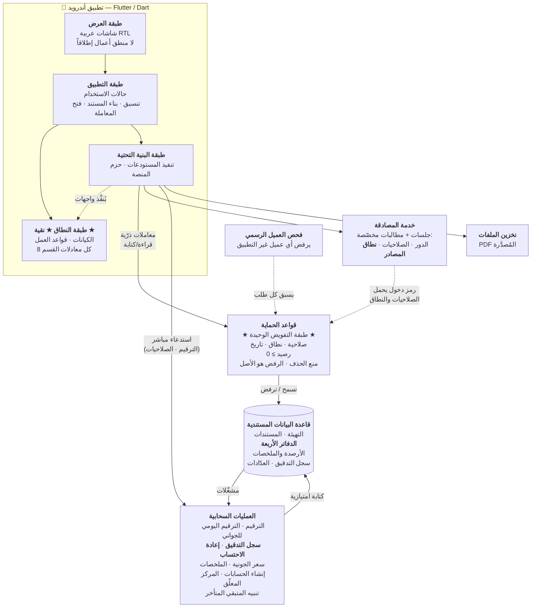

# C2 — مخطط الحاويات (Container Diagram)

| البند | القيمة |
|---|---|
| **الإلزامية** | **M** |
| **الطبيعة** | **LIVING** — يتغيّر عند إضافة/إزالة حاوية |
| **المالك** | المهندس المعماري (ARCH) |
| **المستوى** | **C2** — الحاويات التقنية الكبرى · الجمهور: **المطوّرون والمهندسون** |

---

## المخطط



---

## الحاويات

| # | الحاوية | التقنية | المسؤولية | ما **لا** تفعله |
|---|---|---|---|---|
| 1 | **تطبيق أندرويد** | Flutter / Dart | الواجهة العربية RTL · بناء المستندات · **تنفيذ المعاملات الذرّية** · التحقق الاستباقي · فتح واتساب/الرسائل · الطباعة | **لا يفرض تفويضاً** · لا يكتب سجل التدقيق · لا يُرقِّم المستندات · **لا يكتب في الأرصدة والملخصات مباشرة** |
| 2 | **فحص العميل** | خدمة مُدارة | رفض أي عميل غير التطبيق الرسمي **قبل** وصول الطلب للقواعد | لا يفحص صلاحية المستخدم |
| 3 | **خدمة المصادقة** | خدمة مُدارة | الجلسات · قفل الحساب بعد محاولات فاشلة · **حمل الصلاحيات ونطاق المصادر في رمز الدخول** | **لا تُخزِّن كلمات المرور في القاعدة إطلاقاً** |
| 4 | **قواعد الحماية** | قواعد داخل بنية القاعدة | **كل فحوص التفويض**: الصلاحية · النطاق · التاريخ والتوقيت · **الرصيد ≥ 0** · **السبب النصي** · منع الحذف · منع الحقول الممنوعة | لا تحوي منطقاً معقّداً (ترقيم · إعادة احتساب) |
| 5 | **قاعدة البيانات المستندية** | قاعدة مستندية مُدارة | **مصدر الحقيقة الوحيد** — كل المستندات والدفاتر والأرصدة والملخصات وسجل التدقيق | لا قيود مفتاح أجنبي ولا استعلامات ربط ⟵ يُعوَّض بالتصميم |
| 6 | **العمليات السحابية** | دوال مُدارة | ما **لا يُؤتمَن عليه الجهاز**: الترقيم · **سجل التدقيق** · **إعادة الاحتساب** · بناء الملخصات · إنشاء الحسابات عند إضافة مصدر · المركز المعلّق · رصد المتبقي المتأخر · مزامنة الصلاحيات | لا تحوي منطق واجهة |
| 7 | **تخزين الملفات** | خدمة مُدارة | حفظ PDF المُصدَّرة ومشاركتها | — |

---

## الطبقات داخل التطبيق (تفصيل الحاوية 1)

| الطبقة | تعتمد على | القاعدة الملزمة |
|---|---|---|
| **العرض** | التطبيق | **لا منطق أعمال إطلاقاً** — و`if` على قاعدة عمل داخل شاشة **انحراف معماري** |
| **التطبيق** | النطاق · البنية التحتية | تنسيق الخطوات وفتح المعاملة — **لا معادلات** |
| **النطاق ★** | **لا شيء** | **نقية** — لا تستورد أي حزمة منصة ولا مكتبة واجهة · **وتُفحَص هذه القاعدة آلياً** |
| **البنية التحتية** | النطاق (تنفيذاً لواجهاته) | التحويل من/إلى المستندات · استدعاء المنصة |

*التفصيل والمبرر: [`ADR-0009`](../adr/ADR-0009-app-layering.md) — **معتمد** ✅.*

---

## بروتوكولات التفاعل

| المسار | البروتوكول | ملاحظة |
|---|---|---|
| التطبيق ⟵⟶ القاعدة | **اتصال مباشر ومشفَّر عبر حزم المنصة** | **بلا خادم وسيط وبلا REST API** |
| التطبيق ⟶ العمليات السحابية | استدعاء مباشر | **للترقيم ومنح الصلاحيات** — لا يجوز أن يفعلهما الجهاز |
| القاعدة ⟶ العمليات السحابية | **مشغّلات على الكتابة** | سجل التدقيق · إعادة الاحتساب · الملخصات |
| العمليات السحابية ⟶ القاعدة | **كتابة امتيازية** | تتجاوز قواعد الحماية بحكم موقعها — **ولذلك منطقها هو الحارس** |

> **قاعدة الكتابة الحاسمة:** الأرصدة والملخصات وسجل التدقيق والعدّادات
> والمركز المعلّق **تكتبها السحابة أو المعاملة فقط** — **والكتابة عليها من
> التطبيق مرفوضة في قواعد الحماية**.

---

## نمط تنفيذ أي عملية تمسّ الأرصدة

```text
① طلب رقم المستند من السحابة
② معاملة ذرّية واحدة:
     القراءات أولاً  →  التحقق  →  الكتابات
     (وإن عدّل مستخدم آخر أي سجل مقروء قبل الالتزام،
      تُلغى المعاملة وتُعاد تلقائياً على البيانات الجديدة)
③ بعد النجاح — عمليات سحابية:
     سجل التدقيق · إعادة احتساب سعر الجونية · الملخصات ·
     المركز المعلّق · تحديث المتبقي المتأخر · تطبيق الفائض
```

*المستوى التالي: [`c3-component-diagram.md`](c3-component-diagram.md).*
