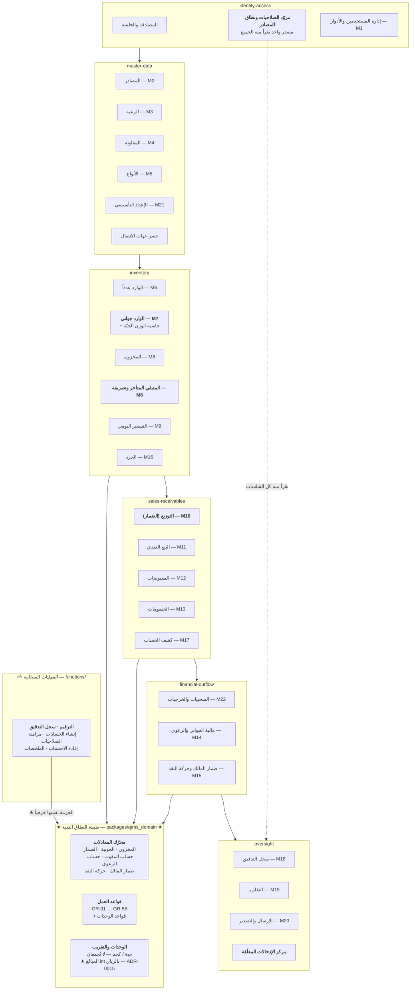
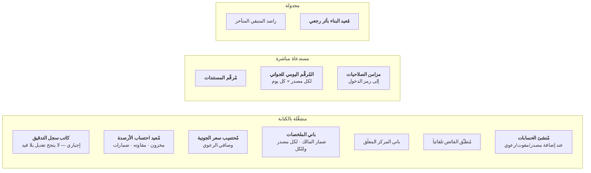

# C3 — مخطط المكوّنات (Component Diagram)

| البند | القيمة |
|---|---|
| **الإلزامية** | **C** (مشروط) — أُنشئ لأن النظام يحوي **22 وحدة** وتعقيده يستدعيه |
| **الطبيعة** | **LIVING** |
| **المالك** | ARCH / DEV |
| **المستوى** | **C3** — المكوّنات داخل حاويتَي «تطبيق أندرويد» و«العمليات السحابية» |

> **ملاحظة على مستوى C4:** **لا يُنشأ مخطط C4 (مستوى الكود) في هذا التشغيل**
> — يُنشأ لاحقاً **للأجزاء المعقّدة وحدها** إن استدعت (مثل خوارزمية احتساب
> سعر الجونية)، تجنّباً للإفراط في التوثيق كما توصي UPDS-07 §2.1.

---

## 1. مكوّنات تطبيق أندرويد — مجمَّعة بالقدرة

> ★ **`ADR-0012`:** طبقة النطاق **حزمة Dart نقية مستقلة** في
> `packages/qtms_domain/` — **لا مجلد داخل حزمة التطبيق**. وهذا ما يجعل
> «مشتركة» في الرسم أعلاه **واقعاً تقنياً لا نيّة**: `functions/` تُبنى في
> حاوية **Dart بلا Flutter**، فلا يمكنها اعتماد حزمة تعتمده.
> ⚠️ **ويُقرأ `coding-standards.md` §3 مقروناً بذلك الـADR** — التقسيم
> بالقدرة والطبقات الأربع كما هي، **والفرق الوحيد أن `domain/` انتقل**.

## 2. مسؤولية كل مكوّن حرج

| المكوّن | مسؤوليته | القاعدة الحاكمة |
|---|---|---|
| **مزوّد الصلاحيات ونطاق المصادر** | **مصدر واحد** تقرأ منه كل الشاشات لإظهار أو إخفاء العناصر | **إخفاء العنصر تجربة، وحمايته في قواعد الحماية** — ولا يجوز الاكتفاء بالأول |
| **الوارد جواني `M7`** | أعقد مكوّن: ثلاث حالات لوزن الحبة · حاسبة وزن حيّة · **توريد السكرب فوراً** · تأكيد الوزن الضائع | `BR-M7-01` … `BR-M7-20` |
| **المتبقي المتأخر `M8`** | **يفتح `M10`/`M11` مثبَّتة على تاريخ مخزون قديم** — **المسار الوحيد المصرَّح به** لذلك | `GR-15` · `ADR-0006` |
| **التوزيع `M10`** | **معرّف مركّب يفرض توزيعة واحدة** لكل (مقوت × مصدر × تاريخ) · **وإخفاء عمود السعر كلياً** بحسب الصلاحية | `GR-18` · `GR-35` |
| **المقبوضات `M12`** | التوزيع التلقائي **يُحسَب محلياً ويُعرَض للمراجعة قبل الحفظ ولا يكتب** | `BR-M12-07` |
| **السحبيات والخرجيات `M22`** | **سجلّان بصلاحيات منفصلة تماماً** · **والمصدر إلزامي دائماً** | `GR-42` · `GR-43` |
| **ضمار المالك `M15`** | **البطاقة تُبنى حسب صلاحيات قارئها** — بندان يظهران أو يختفيان بالكامل | `AT-43` · `E-29` |
| **مركز الإدخالات المعلّقة** | **يلاحق ويذكّر ولا يمنع** · وزر [إدخال] **ينقل لنفس الحقل في شاشته الأصلية** | `GR-50` |
| **محرّك المعادلات** | **كل معادلة من القسم 8 لها دالة واحدة** لا تُكرَّر في أي شاشة | `P-10` · `ADR-0009` |
| **الوحدات والتقريب** | **لا تُجمع الحبات مع الأوزان أبداً** · والتقريب **في نهاية السلسلة فقط** — ★ **وكل مبلغ `int` بالريال، والتقريب في موضعيه المعلومين وحدهما** | `GR-19` · `§8.11` · ★ `ADR-0015` |

## 3. مكوّنات العمليات السحابية

| المكوّن | لماذا **لا يجوز** أن يكون في التطبيق |
|---|---|
| **كاتب سجل التدقيق** | لو كتبه الجهاز لأمكن تزويره أو تخطّيه — **وهو الحافظ الوحيد للتاريخ** بعد `ADR-0004` |
| **المُرقِّم اليومي للجواني** | مستخدمان متزامنان ينتجان **رقماً مكرراً** (`E-43`) |
| **مُعيد احتساب الأرصدة** | يجب أن يعمل **بعد نجاح المعاملة** بصرف النظر عن حالة الجهاز |
| **مُحتسِب سعر الجونية** | يقرأ **كل** حركات الجونية — قراءة ثقيلة لا تُحمَّل على الجهاز · **وتُنفَّذ بتجميع** |
| **مُنشئ الحسابات** | إضافة مصدر بـ50 مقوتاً و10 رعية = **60 كتابة** لا تُترَك لجهاز قد ينقطع |
| **مزامن الصلاحيات** | **لا يجوز لجهاز أن يمنح صلاحيات** (`BR-M1-08`) |
| **مُطبِّق الفائض** | **يكتب بياناً آلياً** بتاريخ الدفع — منطق يجب أن يكون موحّداً |

## 4. الاعتماديات الممنوعة

> **قواعد تُفحَص آلياً في التكامل المستمر:**

| ممنوع | لماذا |
|---|---|
| **طبقة النطاق ⟶ حزم المنصة أو الواجهة** | تفقد نقاءها فتصير المعادلات غير قابلة للاختبار بلا سحابة |
| **العرض ⟶ البنية التحتية مباشرةً** | يتخطّى حالات الاستخدام فيتسرّب منطق الأعمال للشاشة |
| **قدرة ⟶ قدرة أعلى منها** (`master-data` ⟶ `sales-receivables`) | يكسر الاعتماد أحادي الاتجاه ويُنشئ دورة |
| **أي مكوّن ⟶ كتابة مباشرة في الأرصدة أو الملخصات أو سجل التدقيق** | **مرفوض في قواعد الحماية أصلاً** |

*المرجع الكامل لكل مكوّن: `docs/04-design/module-design/`.*
