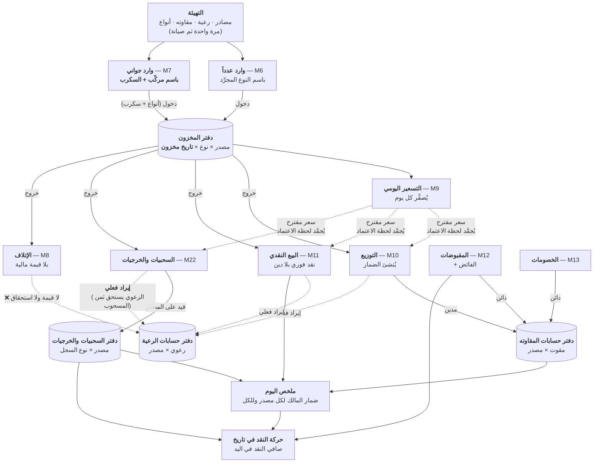
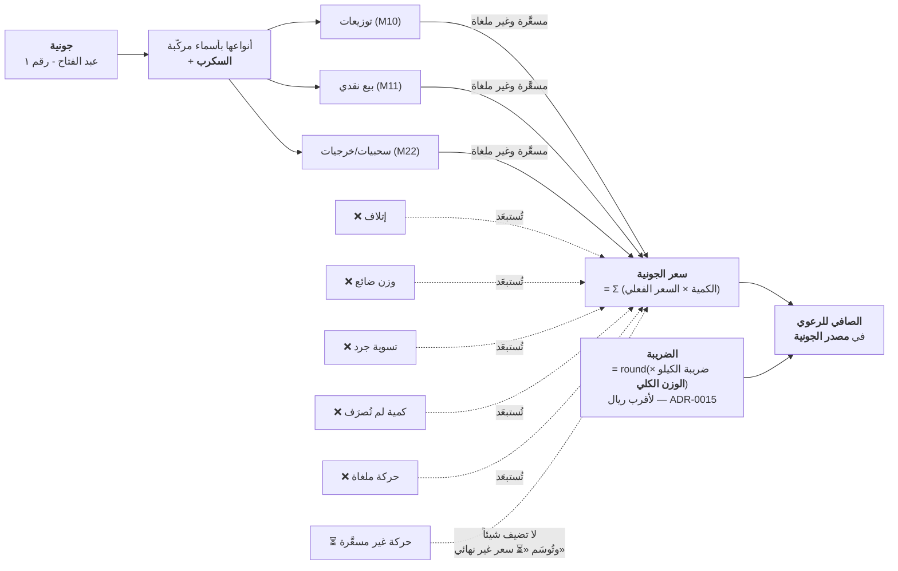
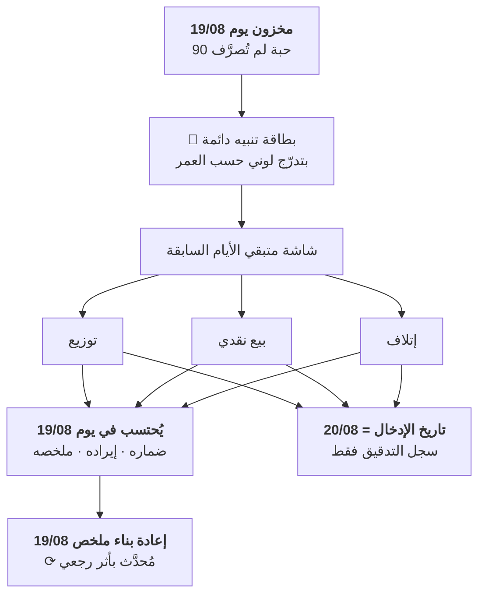
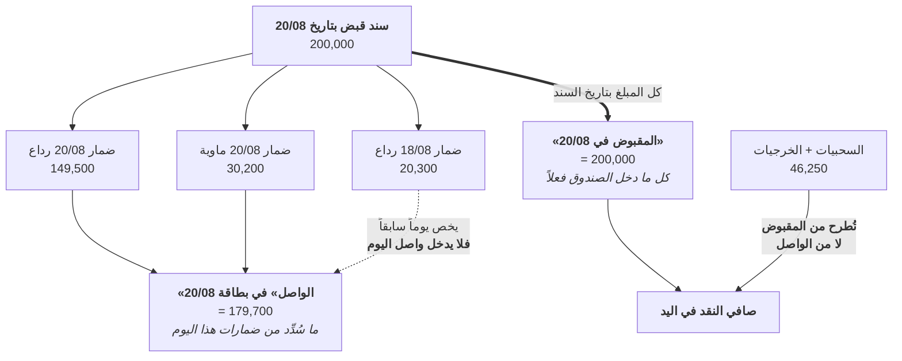
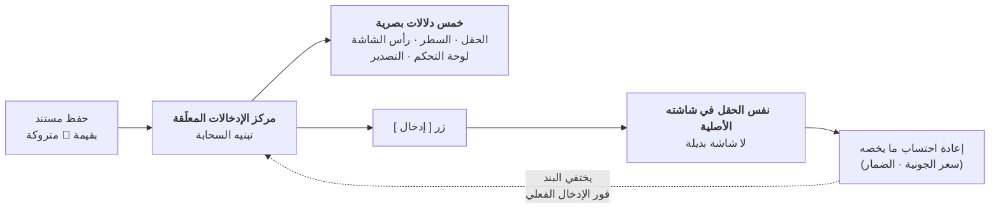
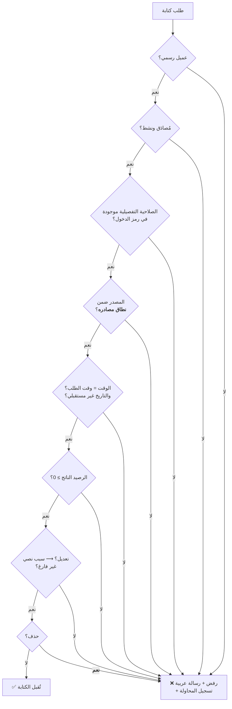

# مخططات تدفق البيانات — QTMS

| البند | القيمة |
|---|---|
| **الإلزامية** | **C** (مشروط) |
| **الطبيعة** | **LIVING** |
| **المالك** | المهندس المعماري (ARCH) |

---

## 1. التدفق الرئيسي — دورة اليوم الكاملة

> **قراءة المخطط:** الأسهم **المصمتة** حركات في الدفاتر · و**المتقطّعة**
> اشتقاق محسوب (سعر الجونية · الملخصات).

## 2. تدفق احتساب سعر الجونية — الأدق في النظام

**الخصائص الحاكمة:**
- **سعر الجونية رقم حيّ** يتغيّر حتى اكتمال تصريف كل أنواعها وتسعيرها.
- **يُعاد احتسابه تلقائياً** عند أي توزيع أو بيع أو سحبية أو تسعير أو تعديل
  أو إلغاء أو **تصريف متبقٍ متأخر ولو بعد أيام**.
- ⚠️ **من أغلى عمليتين في النظام** — تُنفَّذ **بتجميع** (`ADR-0008`).

## 3. تدفق تصريف المتبقي المتأخر — التاريخان

> **جوهر التدفق:** **الأثر المخزني والمالي في اليوم الأصلي · وأثر التدقيق
> في يوم التسجيل.** والخلط بينهما يفسد كل تقرير مخزني (`RISK-07`).

## 4. تدفق «الواصل» مقابل «المقبوض في تاريخ» — التمييز الأهم

> **`GR-41` — رقمان مختلفان لا يجوز الخلط بينهما**، ولكل منهما شاشته.
> و**السحبيات تُقاس على المقبوض الفعلي** لأنها تُصرف من النقد الموجود
> فعلاً لا من ذمة اليوم (`GR-47`).

## 5. تدفق الإدخال المؤجَّل

> **`GR-50`:** المركز **يلاحق ويذكّر ولا يمنع أي عملية**.

## 6. تدفق الحماية لكل كتابة

> **`GR-10` — الرفض هو الأصل:** أي مسار لم يُذكَر صراحةً = **ممنوع**.
> **والحذف مرفوض دائماً** لكل المستخدمين بمن فيهم المالك.

---

*المخططات التسلسلية التفصيلية: `docs/04-design/diagrams/sequence-diagrams/`.*
