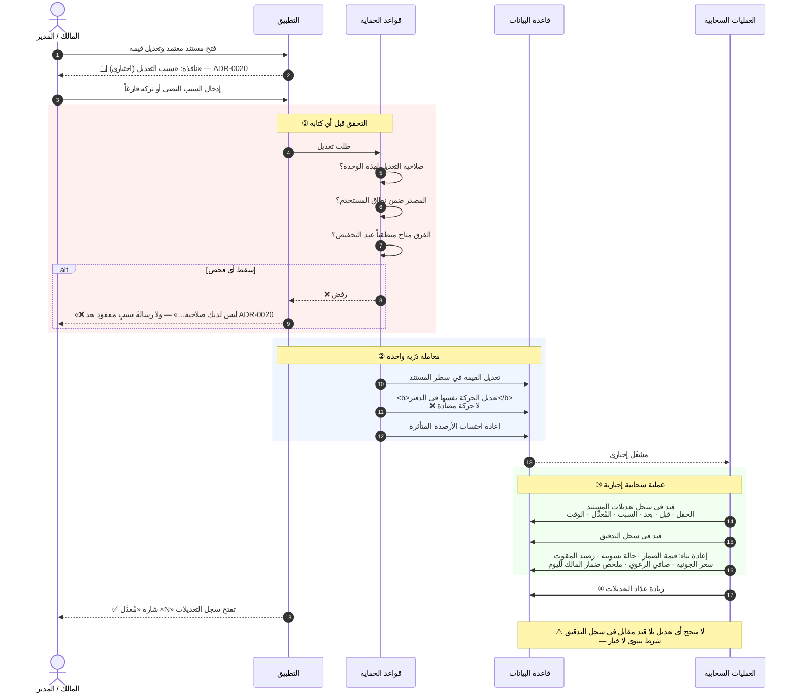
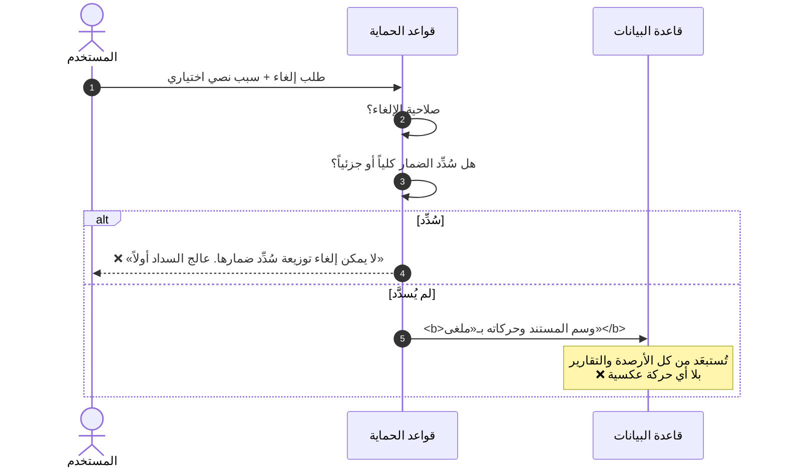

# تسلسل: تعديل حركة معتمدة

**المصدر:** `§10.6` · **المرجع:** `ADR-0004` · **حالة الاستخدام:** `UC-007`



## مثال محسوب (من سيناريو المصدر · الخطوة 15)

```text
تعديل كمية «عوارض» في ضمار خالد:  100  ⟵  95

• تُعدَّل حركة المخزون نفسها : خروج 100 ⟵ خروج 95   ⟵ مخزون العوارض +5
• تُعدَّل حركة الحساب نفسها  : 88,000 ⟵ 83,600
• قيمة الضمار               : 148,000 − 4,400 = 143,600
• شارة «مُعدَّل ×1» + قيد كامل بالقيمة قبل وبعد والسبب
• ❌ لا سطر عكسي ولا حركة تصحيحية في أي دفتر
```

## مسار الإلغاء (بديل التعديل)



## ★★ الضمانان الباقيان (كانا ثلاثة قبل `ADR-0020`)

| الضمان | كيف يُفرض |
|---|---|
| **لا تعديل بلا صلاحية** | قاعدة الحماية ترفض — **حتى من خارج التطبيق** |
| ~~**لا تعديل بلا سبب**~~ | ⛔⛔★★★ **أُلغي بـ`ADR-0020` (2026-08-27)** — ★ **السبب اختياريٌّ في كل العمليات** |
| **لا تعديل بلا أثر في السجل** | **مشغّل سحابي إجباري** · والسجل **لا يُعدَّل ولا يُحذف من أحد** |

**الاختبار المرجعي:** `AT-57` · `AT-58` · `AT-59` · `AT-60` · `AT-61` ·
`E-16` · `E-17` · `E-18` · `E-19`.
