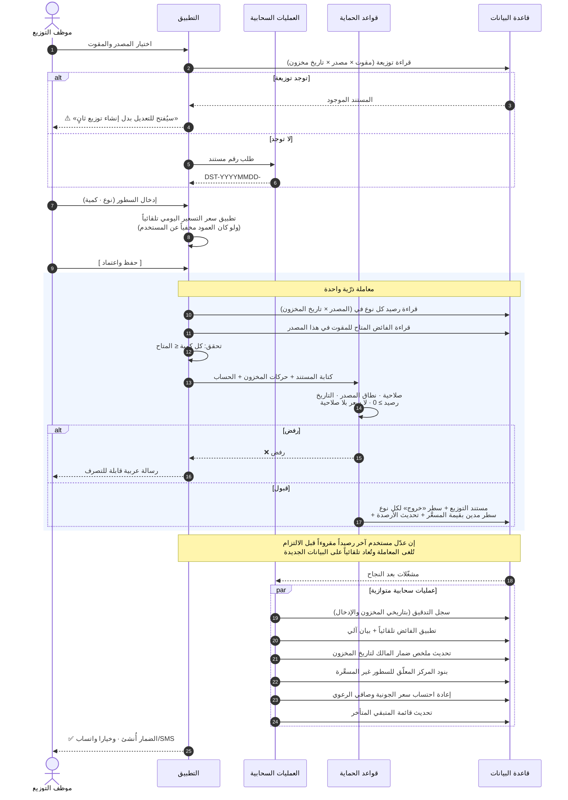

# تسلسل: اعتماد توزيع

**المصدر:** `§10.2` · **المتطلب:** `FR-M10-*` · **الوحدة:** `M10`

**نقاط حاكمة:**
1. **الخصم المخزني فوري في كل الأحوال**، **والمديونية بقيمة المسعَّر فقط**.
2. **السعر يُطبَّق تلقائياً ويُحتسب الضمار كاملاً ولو أُخفي العمود** (`ت-12`).
3. **لا استدعاءات خارجية داخل المعاملة** — لأنها تُعاد تلقائياً.
4. **الاختبار المرجعي:** `AT-20` … `AT-25` · `E-01` · `E-04` · `E-05`.
