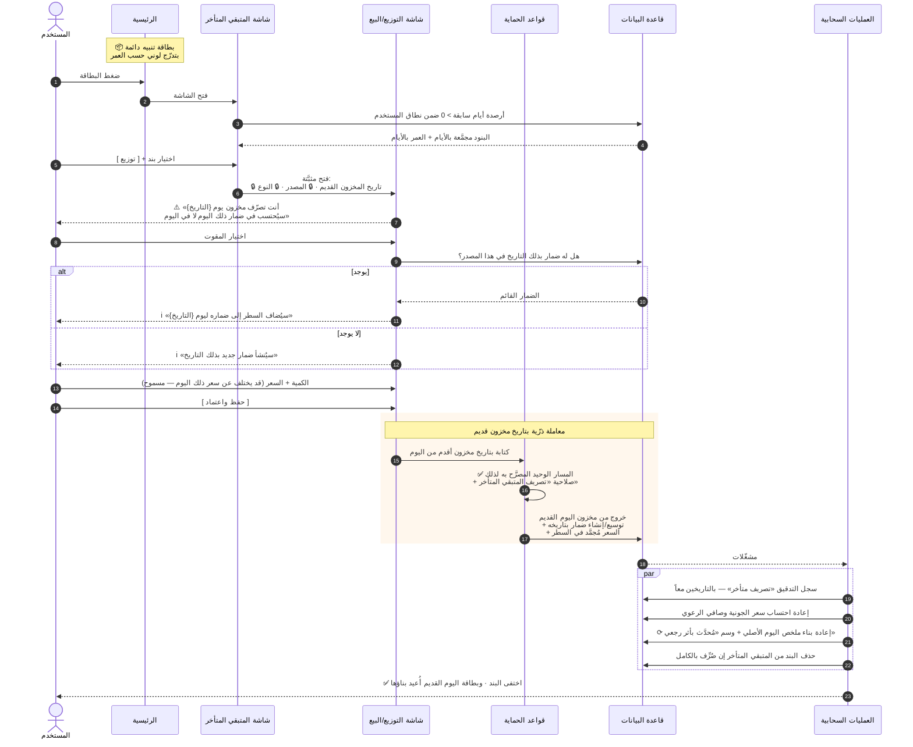

# تسلسل: تصريف متبقٍ متأخر

**المصدر:** `§10.3` · **المتطلب:** `FR-M8-09` … `FR-M8-16` · **الوحدة:** `M8`

**المسارات البديلة:**

| الإجراء | الفرق |
|---|---|
| **بيع نقدي** | يُحتسب في **«نقدي» اليوم الأصلي** لا اليوم الحالي |
| **إتلاف** | معاملة قصيرة: **خروج بلا قيمة مالية** ★★ **وسببٍ اختياري** (`ADR-0020`) · **ولا يستحق الرعوي شيئاً** |
| **تصريف جزئي** | **يبقى البند بالكمية المتبقية ويستمر التنبيه** |

**نقاط حاكمة:**
1. **تاريخان مختلفان في نفس العملية** — مخزون قديم · وإدخال اليوم.
2. **هذا المسار هو الوحيد المصرَّح به** لتاريخ مخزون أقدم من اليوم.
3. ⚠️ **إعادة البناء بأثر رجعي من أغلى عمليتين** — تُنفَّذ **بتجميع**.
4. **الاختبار المرجعي:** `AT-51` … `AT-54` · `E-22` … `E-25`.
