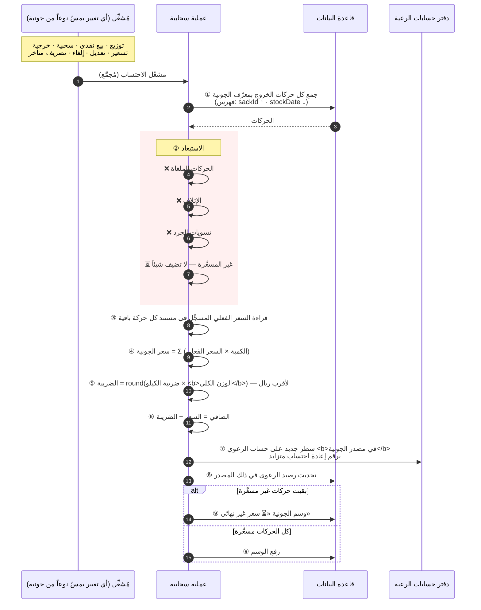

# تسلسل: احتساب سعر الجونية وصافي الرعوي

**المصدر:** `§10.7` · **المتطلب:** `FR-M14-02` … `FR-M14-09` · **الوحدة:** `M14`



## ما يدخل وما لا يدخل

| الحالة | يدخل السعر؟ | يستحق الرعوي؟ |
|---|:-:|:-:|
| توزيع مسعَّر · بيع نقدي · **سحبية/خرجية مسعَّرة** · **إيراد السكرب** | ✅ | ✅ |
| **تصريف متبقٍ متأخر** | ✅ **متى صُرِّف ولو بعد أيام** | ✅ |
| سطر غير مسعَّر بعد | ❌ حتى يُسعَّر | — |
| **كمية لم تُصرَف** · **الإتلاف** · **الوزن الضائع** · **تسوية جرد** · ملغاة | ❌ | ❌ |

## مثال محسوب (من سيناريو المصدر · الخطوة 16)

```text
🧺 عبد الفتاح - جونية رقم ١ — مصدر رداع

  بطوة ج١ ← سالم      :  60 × 1,500 =  90,000
  بطوة ج١ ← خالد      :  40 × 1,500 =  60,000
  عوارض ج١ ← أحمد     : 100 ×   900 =  90,000
  عوارض ج١ ← سالم     : 150 ×   900 = 135,000
  سكرب ج١ ← أحمد      : 0.500 كجم × 4,000 =  2,000
  سكرب ج١ ← بيع نقدي  : 0.700 كجم × 3,500 =  2,450
  ─────────────────────────────────────────────
  سعر الجونية                        = 379,450
  الضريبة  (25 × 45.000 كجم)         =   1,125
  الصافي لعبد الفتاح في «رداع»       = 378,325
```

**ومن جونية مازن رقم ٢:** دخلت **سحبية المالك** (5 حبات × 1,450 = **7,250**)
في سعر الجونية — **فاستحق مازن ثمنها** (`A-15`). وبقيت **85 حبة و0.500 كجم
سكرب لم تُصرَف فلم تُحتسب** (`BR-M14-06`).

## نقاط حاكمة

1. **سعر الجونية رقم حيّ** — يتغيّر حتى اكتمال تصريف كل أنواعها وتسعيرها.
2. **`recalcVersion` متزايد** يمنع تطبيق حساب قديم فوق أحدث عند تنفيذ
   المشغّلات خارج الترتيب.
3. **العملية قابلة للتكرار بلا أثر جانبي** — تُعيد البناء من الحركات
   بالكامل **ولا تُراكِم**.
4. ⚠️ **من أغلى عمليتين في النظام** — **تُنفَّذ بتجميع** لا بعد كل حركة
   منفردة (`NFR-PERF-05` · `RISK-03`).
5. **الاختبار المرجعي:** `AT-44` … `AT-47` · `E-20` · `E-21` · `E-26`.
