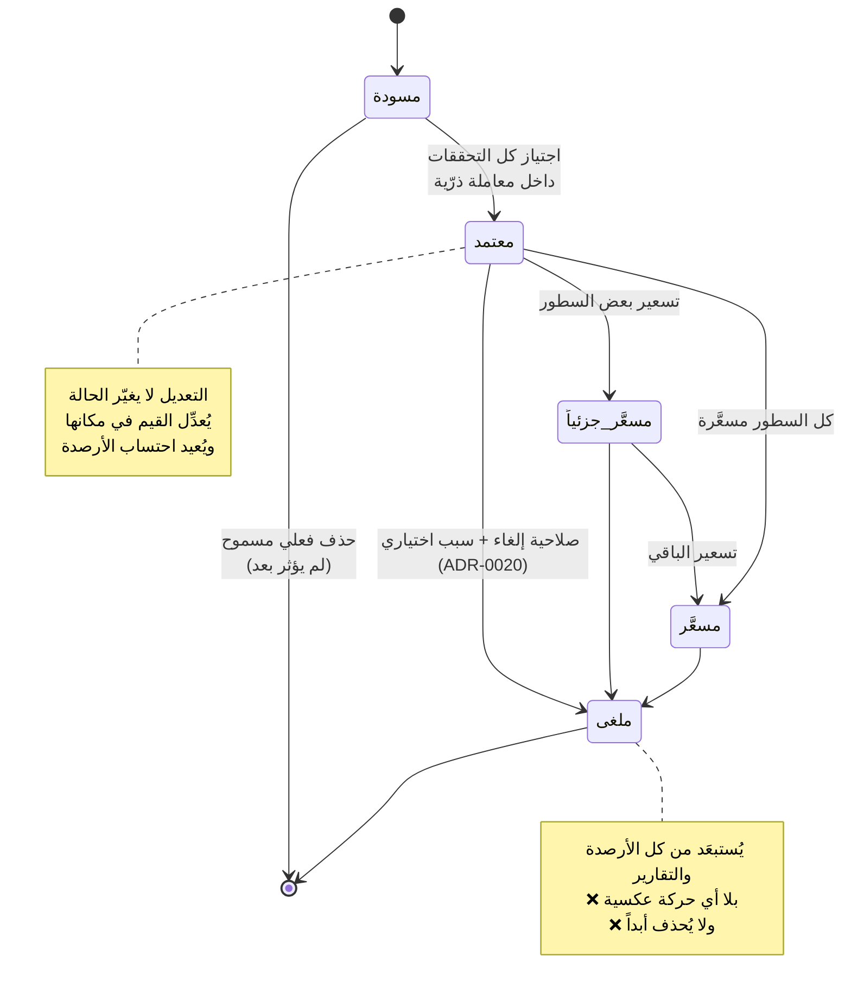
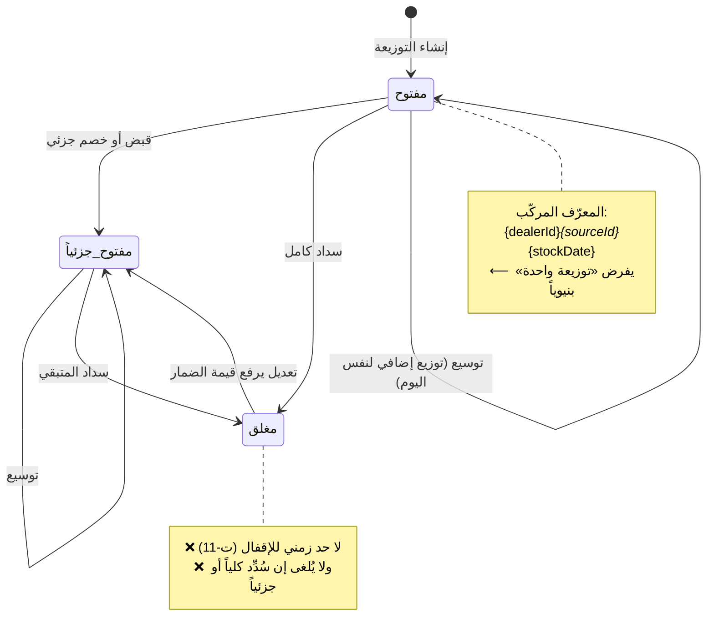
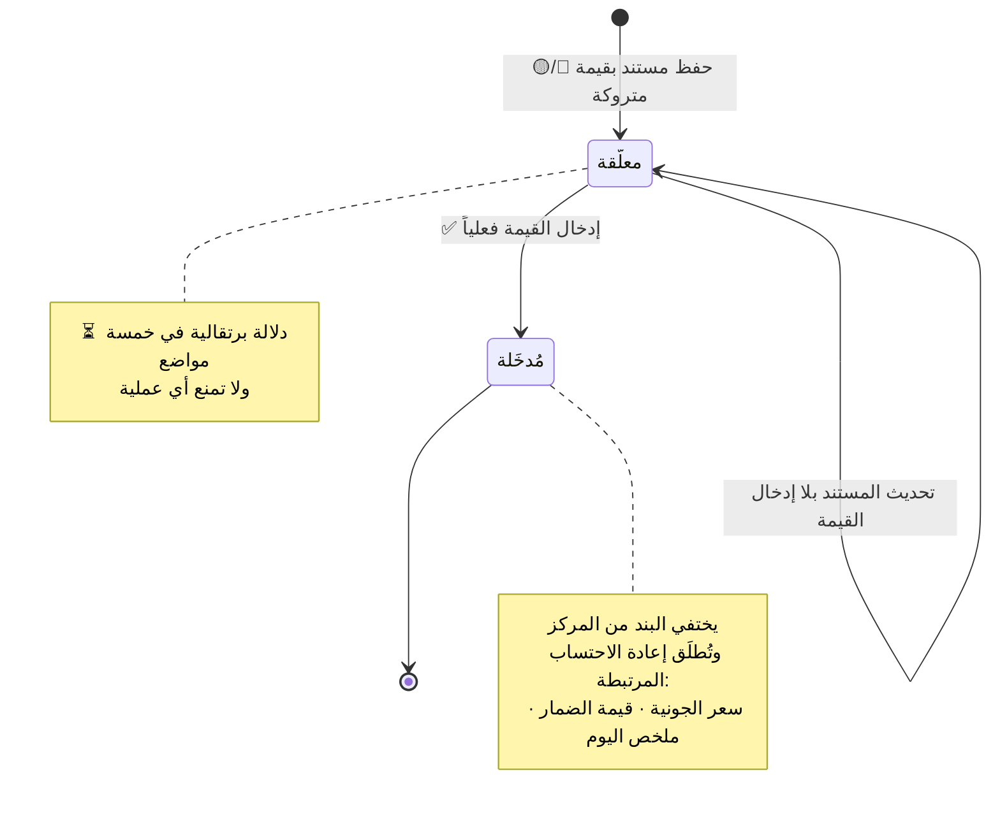
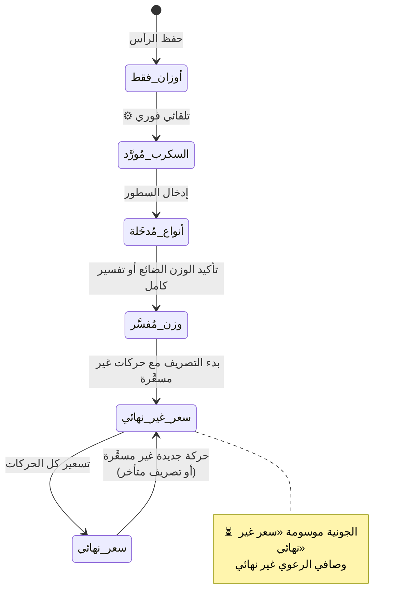

# آلات الحالة: المستند والضمار

**المصدر:** `§4.2` · `§8.3` · **المتطلب:** `SRS §3.3` · `FR-M10-*`

---

## 1. دورة حياة المستند



| الحالة | الأثر على المخزون | الأثر على الحساب | قابل للتعديل | قابل للحذف |
|---|---|---|---|---|
| **مسودة** | لا يوجد | لا يوجد | ✅ | ✅ **(الوحيدة)** |
| **معتمد** | ✅ فوري | حسب نوع المستند | ✅ **بصلاحية + سبب + تسجيل** | ❌ |
| **مسعَّر جزئياً** | تم مسبقاً | ✅ **بالمُسعَّر فقط** | ✅ بصلاحية + سبب | ❌ |
| **مسعَّر** | تم مسبقاً | ✅ بالكامل | ✅ بصلاحية + سبب | ❌ |
| **ملغى** | **يُستبعَد** | **يُستبعَد** | ❌ | ❌ |

**قواعد الانتقال الملزمة:**
1. **لا انتقال يعيد مستنداً معتمداً إلى مسودة.**
2. **لا حذف نهائي لأي مستند معتمد** لأي مستخدم **بمن فيهم المالك**.
3. **التعديل لا يغيّر الحالة** — يُعدِّل القيم ويُعيد الاحتساب (`A-14`).
4. **الإلغاء يَسِم المستند وحركاته معاً**، ويشترط **سبباً نصياً**.

> **«مسعَّر جزئياً»:** التوزيعة الواحدة قد تحتوي سطوراً مسعَّرة وأخرى غير
> مسعَّرة معاً. **المديونية تنشأ بقيمة السطور المسعَّرة فقط**، وتبقى الباقية
> في **مركز الإدخالات المعلّقة** حتى تُسعَّر، **وعندها تُضاف قيمتها للضمار**.

---

## 2. دورة حياة الضمار



```text
المتبقي على الضمار = قيمة الضمار − المسدَّد − المخصوم

المتبقي = قيمة الضمار      → مفتوح
0 < المتبقي < القيمة       → مفتوح جزئياً
المتبقي = 0                → مغلق
```

**قواعد حاكمة:**
1. **الضمار ليس سجلاً مستقلاً** — هو **مستند التوزيع نفسه** مضافاً إليه حقول
   التسوية، لأن لكل **(مقوت × مصدر × تاريخ مخزون)** توزيعة واحدة فقط.
2. **حقول التسوية تكتبها السحابة لا التطبيق.**
3. **توزيع لاحق من نفس اليوم يُوسِّع الضمار القائم** ولا يُنشئ ثانياً —
   **بما في ذلك تصريف متبقٍّ متأخر يُوسِّع ضمار يومه الأصلي**.
4. **لا يُلغى ضمار سُدِّد كلياً أو جزئياً** حتى تُعالَج المقبوضات والخصومات.
5. **الفائض المتاح يُطبَّق تلقائياً** على أي ضمار جديد ببيان آلي.

---

## 3. دورة حياة القيمة المعلّقة



---

## 4. دورة حياة الجونية (اكتمال الاحتساب)



> **سعر الجونية رقم حيّ** يتغيّر حتى اكتمال تصريف كل أنواعها وتسعيرها —
> **ويعود من «نهائي» إلى «غير نهائي»** إن صُرِّف متبقٍّ منها لاحقاً بلا سعر.
