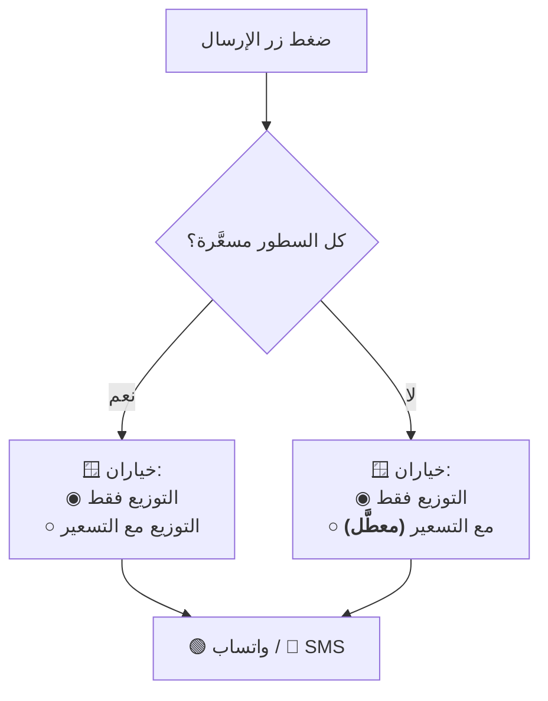

# تصميم وحدة: الإرسال والتصدير (`messaging`)

| البند | القيمة |
|---|---|
| **الحالة** | ✅★★★ **منفَّذ ومُثبَتٌ حيّاً** (2026-08-31 · `WU-010`) — ⛅ **على `qtms-callables-00021-v7j` بثلاثةَ عشرَ سيناريو على `Pixel_6_API_36`**: **الرسالة والقوالب والمستند المُصدَّر ومشاركتُه وقيدُ التصدير وعرضُ رفضه** |
| **الوحدات المغطّاة** | `M20` |
| **يعتمد على** | `distribution` · `settlement` · `outflow` · `master-data` |
| **المتطلبات** | `FR-M20-01` … `FR-M20-16` |

---

## 1. المسؤوليات

1. **فتح** محادثة واتساب أو الرسائل بنص جاهز.
2. توليد ملفات PDF للسندات والكشوف.
3. ⛔⛔★★★ **~~الطباعة الحرارية~~ — خارج النطاق نهائياً** بقرار المالك في
   `IQ-033`، ✅ **ويوثّقه** [`ADR-0023`](../../03-architecture/adr/ADR-0023-drop-thermal-printing.md)
   **معتمداً (2026-08-30).** ⛔⛔ **فلا حزمةَ طباعةٍ ولا بلوتوث ولا واجهةَ
   طباعةٍ ولا بندَ قبولٍ لها** — ★ **وصيغةُ المخرَج المدعومة PDF وحدها.**
   ⛔ **ولا تُحذَف المسؤولية من هذا الجدول** (`UPDS-05` §4.5) — ★ **تُوسَم.**

## 2. المبدأ الحاكم

> **النظام يفتح المحادثة ولا يرسل تلقائياً.** المستخدم هو من يضغط زر
> الإرسال داخل واتساب/الرسائل — **وهذا يحفظ سيطرته الكاملة ويتوافق مع
> سياسات المنصات**.
>
> **ونتيجة مباشرة:** النظام **لا يعرف إن وصلت الرسالة**، **ولا يُسجَّل أي
> أثر للإرسال إطلاقاً** *(محذوف بقرار المالك)*.

## 3. القوالب — نصوص ثابتة مبرمجة

| البند | القاعدة |
|---|---|
| **الموضع** | **ثوابت في كود التطبيق** — **لا تُقرأ من إعدادات ولا من قاعدة البيانات** |
| **التعديل** | **لا يعدّلها أحد من أي واجهة** — تغييرها يتطلب **إصدار نسخة جديدة من التطبيق** |
| **المتغيّرات** | `{ }` تُملأ من بيانات المستند لحظة الإرسال |
| **الاستثناء الوحيد** | **`{اسم المحل}`** يُقرأ من **الإعداد التأسيسي** |

**القوالب الأربعة المعتمدة:** ① التوزيع فقط · ② التوزيع مع التسعير ·
③ سند قبض · ④ سند خصم.

> **لماذا ثوابت لا إعدادات؟** لأن **«لا يعتمد أي منطق تشغيلي على قراءة من
> الإعدادات»** (`BR-M21-03`) — فلا يُغيَّر نص يمثّل التزاماً تجاهياً
> بتعديل حقل.

> ✅★★★ **ونصُّ القوالب حُسم بقرار المالك في `IQ-031` (الخيار ب · 2026-08-30)**
> — ★ **وموضعُه ثوابتُ نطاقٍ خالصة:**
> [`message_templates.dart`](../../../packages/qtms_domain/lib/capabilities/oversight/domain/message_templates.dart)
> ⛔ **لا إعدادات ولا قاعدة بيانات** (`FR-M20-06`).
>
> ✅★★★ **والترويسة بلا اسم المصدر — بـ**[`CR-004`](../../02-requirements/change-requests/CR-004-message-template-source-line.md)
> **المعتمد (2026-08-30).** ⛔⛔★★ **وحدُّه ضيقٌ منصوصٌ عليه:** ★ **الحذفُ
> في ترويسة الرسالة وحدها** — ⛔ **ولا يمتدّ إلى المستند المُصدَّر ولا إلى
> قيد التدقيق ولا إلى تقسيم البيانات** (`CR-004` §2.1): ⟵ **فالمصدر أوّلُ
> صفٍّ في ترويسة الـPDF**، ★ **ومبرِّرُ `FR-M20-09` مصونٌ في الدليل المحفوظ.**
>
> ⏳★ **والقالب ④ (سند الخصم) مكتوبٌ ومُختبَر** ⛔ **وغيرُ موصولٍ بشاشة** —
> ★ **لأن `M13` تُبنى في `WU-013`.**

## 4. قواعد التنسيق الملزمة

| البند | القاعدة |
|---|---|
| **الأرقام** | فواصل الآلاف · **بلا كسور عشرية للمبالغ** · **وثلاث خانات للأوزان** |
| **الإجماليات** | **تفصل الحبات عن الأوزان**: «الإجمالي: 60 حبة + 0.500 كجم» |
| **الترويسة** | ★★ **تاريخ المخزون في كل رسالة تخص توزيعاً أو ضماراً** — ⛔ **بلا اسم المصدر** (`CR-004` معتمد · 2026-08-30) · ✅★★ **واسمُ المصدر أوّلُ صفٍّ في ترويسة المستند المُصدَّر** ⟵ **فالفصلُ بالمصدر موثَّقٌ في الدليل لا في الرسالة** |
| **الترميز** | UTF-8 بدعم كامل للعربية والأسطر الجديدة |
| **الرقم** | **مُطبَّع بصيغة دولية** لواتساب · **ومحلي** للرسائل النصية |

## 5. منطق خيار الإرسال

## 6. مواضع الظهور

| الشاشة | ما يُرسَل |
|---|---|
| **توزيع غير مسعَّر أو جزئي** | **التوزيع فقط** — الأنواع والكميات بلا أسعار |
| **توزيع مسعَّر بالكامل** | خيار: التوزيع فقط **أو** مع التسعير |
| سند القبض | إيصال بالضمارات المسددة والرصيد بعدها |
| سند الخصم | إيصال الخصم |
| سند البيع النقدي | إيصال البيع |
| **سند السحبية/الخرجية** | **إيصال داخلي (PDF) فقط** |
| بطاقة المقوت | كشف الحساب / الرصيد الحالي |
| بطاقة الرعوي | كشف الجواني والصافي **مفصولاً بالمصدر** |

## 7. معالجة غياب الخدمة

| الحالة | السلوك |
|---|---|
| **لا رقم هاتف صحيح** | **لا يظهر الزران أصلاً** ⟵ «❌ لا يمكن الإرسال — لا يوجد رقم هاتف صحيح» |
| **واتساب غير مثبَّت** | «⚠️ تطبيق واتساب غير مثبَّت — هل تريد الإرسال عبر رسالة نصية؟» |
| **النص يتجاوز رسالة SMS** | تنبيه **+ خيار نسخة مختصرة** (الإجمالي والرصيد فقط) |
| ⛔⛔ **لا طابعة أصلاً** (`ADR-0023` ✅ **معتمد**) | ★ **تصدير PDF هو المسار لا البديل** — ⛔ **ولا حالةَ «الطابعة غير متصلة» يُعالَجها التطبيق** |

## 8. الخصوصية — قاعدة ملزمة

> ⚠️ **لا تحوي رسائل واتساب/SMS ولا الإيصالات المُصدَّرة أي إشارة لجهة
> التطوير** — فهذه **مخرجات العميل لعملائه هو، لا مساحة إعلانية**
> (`docs/19-assets/developer-identity.md` §الممنوعات · `FR-SYS-30`).

**ولا تحوي الرسالة بيانات حساسة زائدة** — الأنواع والكميات والأسعار والرصيد
المتعلقة بالمستلم نفسه فقط.

## 9. نقاط الانتباه للمنفِّذ

> ⚠️ **لا تُنشئ أي مجموعة لسجل الرسائل ولا أي حقل متابعة إرسال** — الميزة
> **محذوفة بقرار المالك** (`GR-55` · `AT-64`). **والصلاحية تبقى ضابطاً
> لظهور الزرين وعملهما** لا لتتبّع النتيجة.

> ⚠️ **الإرسال إجراء واجهة فقط — لا كتابة في قاعدة البيانات إطلاقاً**
> (`§9.6`). أما **تصدير PDF فيُسجَّل** بالإجراء «تصدير».
>
> ✅★★★ **ومسارُ التسجيل مبنيٌّ فعلاً** (`WU-010` · `IQ-032` الخيار أ): **مفتاحٌ
> واحد `documentExport`** (الكتالوج §2.8) **وعمليةٌ سحابيةٌ واحدة `logExport`**
> (`api-overview.md` §3.1-ط). ⛔⛔ **ولا يكتب التطبيق `audit_log` بحرف** —
> **`allow create, update, delete: if false` للجميع.**
>
> ⛔⛔★★ **وهي أولُ عمليةٍ في النظام تكتب قيداً بلا مستندٍ مصاحب** — ★ **لأن
> التصدير لا يُغيِّر بياناً**: ⟵ **ورُفع حارسُ «لا كتابةَ فارغة» بعَلَمٍ صريحٍ
> مُسمّى** (`AuditedWrite.auditOnly`) ⛔ **لا بإسقاطِ الحارس للجميع**، ★ **ولا
> يُقبَل العَلَم إلا مع الفعل `export` نفسِه.**
>
> ⚠️⚠️ **وحدٌّ معلَن:** ★ **العملية لا تتحقق من وجود المستند المُصدَّر** —
> ⛔ **والأثر محدود بحدّه**: **قيدٌ زائف في سجلٍ يُقرأ بالنطاق نفسه**، ★ **ولا
> يُغيِّر مالاً ولا مخزوناً ولا صلاحية** (`api-overview.md` §3.1-ط).

## 10. الاختبارات المرتبطة

`TC-M20-001` · `TC-M20-002` · `AT-63` · **`AT-64`: إرسال أي رسالة ⟵ لا
يُنشَأ أي سجل إرسال**

✅★★ **والمبنيّ فعلاً في `WU-010`** (2026-08-30):
`packages/qtms_domain/test/capabilities/oversight/domain/message_templates_test.dart`
(**22**) · `export_documents_test.dart` (**13**) ·
`functions/test/export_log_test.dart` (**21**) ·
`test/capabilities/oversight/infrastructure/message_channel_launcher_test.dart` (**8**) ·
`pdf_document_renderer_test.dart` (**5**) ·
`functions_export_log_repository_test.dart` (**5**) ·
`test/capabilities/oversight/presentation/send_document_sheet_test.dart` (**12**).

⛔⛔★★★ **ودرسٌ مقيسٌ من اختبار المحاكي — لا يكشفه اختبارٌ آلي:** ★ **مسارُ
واتساب كان `https://wa.me/…`** ⟵ **ومتصفّحُ النظام يعالج كلَّ رابط `https`**،
⟹ ⛔ **`canLaunchUrl` تصدُق أبداً** ★ **فلا يقع فرعُ `FR-M20-12` قطّ ويُفتَح
المتصفّحُ بدل واتساب.** ✅ **والصواب مخطَّط `whatsapp://` مع إعلان رؤيةٍ في
المانفست** — ★ **وله اختبارُ ارتدادٍ صريح.**
