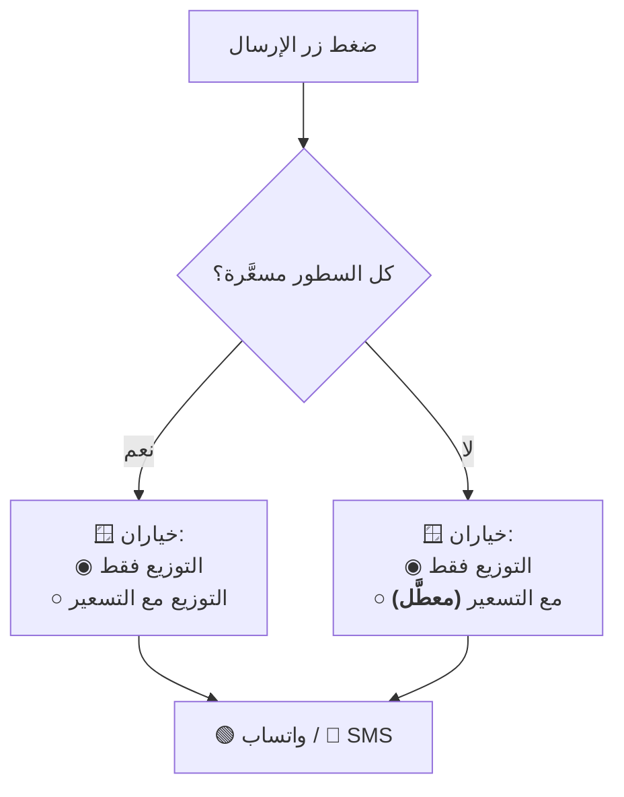

# تصميم وحدة: الإرسال والتصدير (`messaging`)

| البند | القيمة |
|---|---|
| **الحالة** | **مخطَّط** |
| **الوحدات المغطّاة** | `M20` |
| **يعتمد على** | `distribution` · `settlement` · `outflow` · `master-data` |
| **المتطلبات** | `FR-M20-01` … `FR-M20-16` |

---

## 1. المسؤوليات

1. **فتح** محادثة واتساب أو الرسائل بنص جاهز.
2. توليد ملفات PDF للسندات والكشوف.
3. الطباعة الحرارية.

## 2. المبدأ الحاكم

> **النظام يفتح المحادثة ولا يرسل تلقائياً.** المستخدم هو من يضغط زر
> الإرسال داخل واتساب/الرسائل — **وهذا يحفظ سيطرته الكاملة ويتوافق مع
> سياسات المنصات**.
>
> **ونتيجة مباشرة:** النظام **لا يعرف إن وصلت الرسالة**، **ولا يُسجَّل أي
> أثر للإرسال إطلاقاً** *(محذوف بقرار المالك)*.

## 3. القوالب — نصوص ثابتة مبرمجة

| البند | القاعدة |
|---|---|
| **الموضع** | **ثوابت في كود التطبيق** — **لا تُقرأ من إعدادات ولا من قاعدة البيانات** |
| **التعديل** | **لا يعدّلها أحد من أي واجهة** — تغييرها يتطلب **إصدار نسخة جديدة من التطبيق** |
| **المتغيّرات** | `{ }` تُملأ من بيانات المستند لحظة الإرسال |
| **الاستثناء الوحيد** | **`{اسم المحل}`** يُقرأ من **الإعداد التأسيسي** |

**القوالب الأربعة المعتمدة:** ① التوزيع فقط · ② التوزيع مع التسعير ·
③ سند قبض · ④ سند خصم.

> **لماذا ثوابت لا إعدادات؟** لأن **«لا يعتمد أي منطق تشغيلي على قراءة من
> الإعدادات»** (`BR-M21-03`) — فلا يُغيَّر نص يمثّل التزاماً تجاهياً
> بتعديل حقل.

## 4. قواعد التنسيق الملزمة

| البند | القاعدة |
|---|---|
| **الأرقام** | فواصل الآلاف · **بلا كسور عشرية للمبالغ** · **وثلاث خانات للأوزان** |
| **الإجماليات** | **تفصل الحبات عن الأوزان**: «الإجمالي: 60 حبة + 0.500 كجم» |
| **الترويسة** | **اسم المصدر وتاريخ المخزون في كل رسالة تخص توزيعاً أو ضماراً** — لأن الحسابات مفصولة بالمصدر واليوم |
| **الترميز** | UTF-8 بدعم كامل للعربية والأسطر الجديدة |
| **الرقم** | **مُطبَّع بصيغة دولية** لواتساب · **ومحلي** للرسائل النصية |

## 5. منطق خيار الإرسال

## 6. مواضع الظهور

| الشاشة | ما يُرسَل |
|---|---|
| **توزيع غير مسعَّر أو جزئي** | **التوزيع فقط** — الأنواع والكميات بلا أسعار |
| **توزيع مسعَّر بالكامل** | خيار: التوزيع فقط **أو** مع التسعير |
| سند القبض | إيصال بالضمارات المسددة والرصيد بعدها |
| سند الخصم | إيصال الخصم |
| سند البيع النقدي | إيصال البيع |
| **سند السحبية/الخرجية** | **إيصال داخلي (PDF) فقط** |
| بطاقة المقوت | كشف الحساب / الرصيد الحالي |
| بطاقة الرعوي | كشف الجواني والصافي **مفصولاً بالمصدر** |

## 7. معالجة غياب الخدمة

| الحالة | السلوك |
|---|---|
| **لا رقم هاتف صحيح** | **لا يظهر الزران أصلاً** ⟵ «❌ لا يمكن الإرسال — لا يوجد رقم هاتف صحيح» |
| **واتساب غير مثبَّت** | «⚠️ تطبيق واتساب غير مثبَّت — هل تريد الإرسال عبر رسالة نصية؟» |
| **النص يتجاوز رسالة SMS** | تنبيه **+ خيار نسخة مختصرة** (الإجمالي والرصيد فقط) |
| **الطابعة غير متصلة** | **تصدير PDF بديلاً دائماً** |

## 8. الخصوصية — قاعدة ملزمة

> ⚠️ **لا تحوي رسائل واتساب/SMS ولا الإيصالات المُصدَّرة أي إشارة لجهة
> التطوير** — فهذه **مخرجات العميل لعملائه هو، لا مساحة إعلانية**
> (`docs/19-assets/developer-identity.md` §الممنوعات · `FR-SYS-30`).

**ولا تحوي الرسالة بيانات حساسة زائدة** — الأنواع والكميات والأسعار والرصيد
المتعلقة بالمستلم نفسه فقط.

## 9. نقاط الانتباه للمنفِّذ

> ⚠️ **لا تُنشئ أي مجموعة لسجل الرسائل ولا أي حقل متابعة إرسال** — الميزة
> **محذوفة بقرار المالك** (`GR-55` · `AT-64`). **والصلاحية تبقى ضابطاً
> لظهور الزرين وعملهما** لا لتتبّع النتيجة.

> ⚠️ **الإرسال إجراء واجهة فقط — لا كتابة في قاعدة البيانات إطلاقاً**
> (`§9.6`). أما **تصدير PDF فيُسجَّل** بالإجراء «تصدير».

## 10. الاختبارات المرتبطة

`TC-M20-001` · `TC-M20-002` · `AT-63` · **`AT-64`: إرسال أي رسالة ⟵ لا
يُنشَأ أي سجل إرسال**
