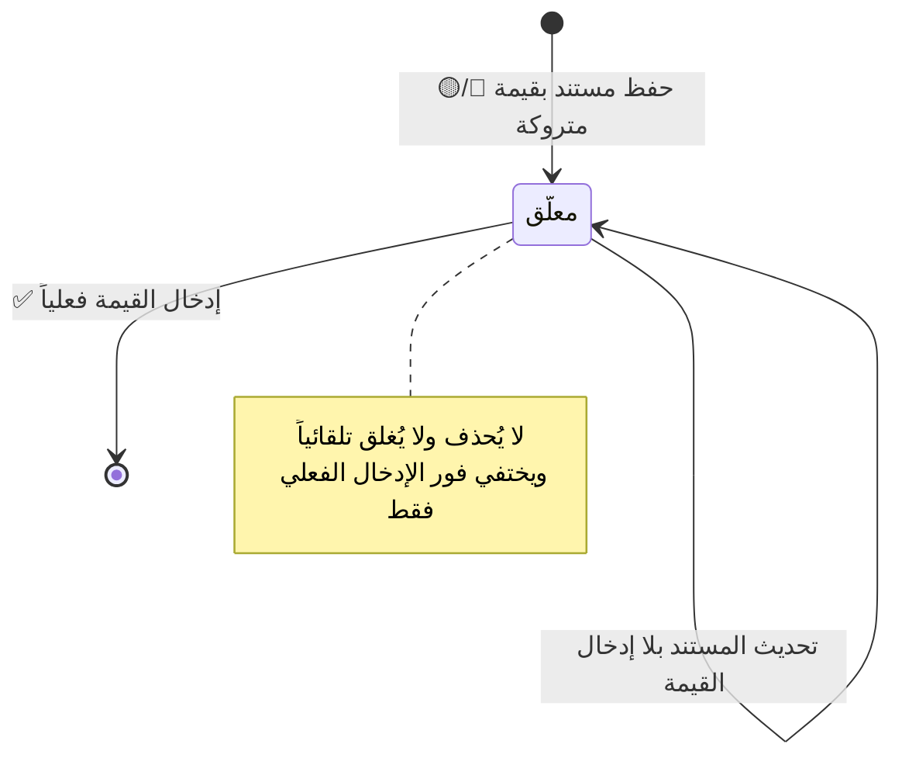

# تصميم وحدة: مركز الإدخالات المعلّقة (`pending-entries`)

| البند | القيمة |
|---|---|
| **الحالة** | ✅ **منفَّذ** (2026-08-30 · `WU-009`) — ⛅ **ومُثبَتٌ حيّاً على `qtms-callables-00020-7hk`** (أربعةَ عشرَ فحصاً على `Pixel_6_API_36`) — راجع §12 |
| **الوحدات المغطّاة** | عابرة — `M7` `M9` `M10` `M22` |
| **يعتمد على** | كل الوحدات التي تحوي حقولاً 🔵/🟡 |
| **المتطلبات** | `FR-SYS-01` … `FR-SYS-10` |

---

## 1. المبدأ الحاكم

> **بعض القيم لا تكون معروفة لحظة إنشاء المستند** (ضريبة الكيلو · أنواع
> الجونية · الأسعار · سعر القات المسحوب). فالنظام **يسمح بتأجيلها بحسب
> الصلاحية، لكنه لا ينساها ولا يسمح بضياعها.**
>
> **ودوره الملاحقة والتذكير لا المنع** — **لا يُلزم بالإدخال ولا يُعطِّل
> أي عملية** (`GR-50`).

## 2. التصنيف الثلاثي لكل حقل

| الرمز | المعنى | السلوك |
|---|---|---|
| **🟢 حالي** | يُدخَل إلزامياً لحظة الإنشاء | **لا يُحفظ المستند بدونه** |
| **🟡 لاحق** | يجوز تركه وإدخاله **من نفس المكان** | يُحفظ المستند **ويدخل المركز** |
| **🔵 حالي/لاحق** | **يختار المستخدم بحسب صلاحيته** | من يملك «الآن» يُدخله · وغيره يُترَك له «لاحقاً» |

**والقاعدة العامة لتصنيف أي حقل جديد مستقبلاً:**

| الفئة | التصنيف |
|---|---|
| حقول الهوية والبنية (الاسم · الهاتف · المصدر · النوع · الكمية · الأوزان) | **🟢 حالي** |
| **كل حقل مالي أو سعري** | **🔵 حالي/لاحق** — **جوهر المرونة المطلوبة** |
| الملاحظات والبيانات الوصفية | 🟢 حالي (اختياري) |
| **أسباب التعديل والإلغاء والإتلاف وتجاوز الحد الأدنى** | **🟢 حالي إلزامي مفروض في قاعدة الحماية** |
| تواريخ التوريد والتوزيع والبيع | **⚙️ تلقائي 🔒** |
| تواريخ القبض والخصم والسحبيات | 🟢 حالي + صلاحية تاريخ سابق |
| النواتج الحسابية | 🧮 محسوبة |

## 3. سجل بنود المركز

| الحقل | ملاحظة |
|---|---|
| `documentType` · `documentId` · `documentNumber` | — |
| **`readableTitle`** | «عبد الفتاح - جونية رقم ١» — **يفهمه المستخدم بلا فتح المستند** |
| **`sourceId`** · `stockDate` | **لاحترام النطاق والفلترة** |
| **`missingField`** | القيمة الناقصة بالاسم العربي |
| **`navigationTarget`** | **الشاشة والحقل بالضبط** |

> **البنود تُنشئها وتحذفها السحابة حصراً** — لا يكتبها التطبيق ولا يحذفها
> المستخدم (`§6.5`).

## 4. الدلالات البصرية الخمس الإلزامية

| الموضع | الدلالة |
|---|---|
| **الحقل نفسه** | إطار برتقالي + «⏳ لم يُدخل بعد — اضغط للإدخال» |
| **سطر السجل في القائمة** | **شارة ⏳ برتقالية + عدّاد**: «⏳ 3 قيم ناقصة» |
| **رأس الشاشة** | شريط تنبيه: «⚠️ يوجد {عدد} قيمة لم تُدخل بعد في هذه الشاشة» |
| **لوحة التحكم الرئيسية** | **بطاقة «⏳ الإدخالات المعلّقة»** بالعدد الإجمالي |
| **عند التصدير أو الإقفال** | **تحذير صريح بأسماء المستندات الناقصة قبل المتابعة** |

> **الدلالة ⏳ برتقالية موحّدة في كل النظام** — لا شكل بديل في أي شاشة.

## 5. البنود التي يلاحقها

| الوحدة | القيمة المعلّقة |
|---|---|
| **`M7`** | ضريبة الكيلو · **الأنواع لم تُدخل** · وزن الحبة · سعر التوزيع · الحد الأدنى · **الوزن الضائع لم يُؤكَّد** |
| **`M9`** | نوع **له كمية في مخزون اليوم** بلا سعر توزيع أو بلا حد أدنى — **بما فيه السكرب** |
| **`M10`** | سطر توزيع بلا سعر وحدة |
| **`M22`** | بند «قات» بلا سعر |

## 6. سلوك زر [ إدخال ] — قاعدة حاسمة

> **ينقل المستخدم مباشرةً إلى نفس الحقل داخل شاشته الأصلية** — **لا شاشة
> إدخال بديلة**، حفاظاً على **وحدة مكان الإدخال**.
>
> ⚠️ **بناء شاشة إدخال موحّدة داخل المركز مخالفة تصميمية** — تُنتج مساراً
> ثانياً للكتابة بقواعد تحقق منفصلة تفترق عن الأصلية.

## 7. دورة حياة البند

**وعند اختفاء البند تُطلَق إعادة الاحتساب المرتبطة به:**
سعر الجونية · قيمة الضمار وحالة تسويته · ملخص اليوم.

## 8. الفلاتر

المصدر · التاريخ · نوع المستند — **ويحترم المركز نطاق مصادر المستخدم**.

## 9. الحالات الحدّية

| # | الحالة | المعالجة |
|---|---|---|
| `E-06` | جونية بلا أنواع ولا ضريبة | **ثلاثة بنود** (الضريبة · الأنواع · تسعير السكرب) |
| `E-27` | سحبية بقات بلا سعر | بند «سعر القات المسحوب» · **وسعر الجونية «غير نهائي»** |
| `AT-23` | توزيعة بسطر غير مسعَّر | بند واحد · والحالة «مسعَّر جزئياً» |
| — | نوع سُعِّر من شاشة الجونية | **يختفي بنده فوراً** — المصدران يكتبان نفس الحقل |
| — | نوع نفد رصيده اليوم | **يختفي بند تسعيره** — لا يُطالَب بتسعير ما لا كمية له |

## 10. نقاط الانتباه للمنفِّذ

> ⚠️ **المركز لا يمنع شيئاً.** أي تنفيذ يمنع الحفظ أو التصدير بسبب بند
> معلّق **يخالف `GR-50`** — الغرض **الملاحقة والتذكير**، والتحذير عند
> التصدير **تحذير لا حجب**.

> ⚠️ **البنود مشتقّة لا مصدر حقيقة** — قابلة لإعادة البناء بالكامل من
> المستندات (`PAT-07`).

## 11. الاختبارات المرتبطة

`TC-SYS-001` · `TC-SYS-002` · `AT-16` · `AT-23` · `AT-24` · `AT-41` ·
`E-06` · `E-27` · `R-28`

---

## 12. ⏳★★★ حالة التنفيذ — `WU-009` (2026-08-30)

### 12.1 ما نُفِّذ فعلاً

| الطبقة | الملفات |
|---|---|
| **النطاق** | [`pending_entry.dart`](../../../packages/qtms_domain/lib/capabilities/oversight/domain/pending_entry.dart) · [`pending_entry_builder.dart`](../../../packages/qtms_domain/lib/capabilities/oversight/domain/pending_entry_builder.dart) |
| **السحابة** | [`pending_entries.dart`](../../../functions/lib/src/pending_entries.dart) — ★ **مربوطٌ في أربعة معالِجات**: `sack_intake_handler` · `daily_pricing_handler` · `inventory_handler` · `distribution_handler` |
| **التطبيق** | [`firestore_pending_entries_directory.dart`](../../../lib/capabilities/oversight/infrastructure/firestore_pending_entries_directory.dart) · [`pending_entries_providers.dart`](../../../lib/capabilities/oversight/application/pending_entries_providers.dart) · [`pending_entries_screen.dart`](../../../lib/capabilities/oversight/presentation/pending_entries_screen.dart) · [`needs_action_row.dart`](../../../lib/core/ui/needs_action_row.dart) |
| **القواعد والفهارس** | ⛔⛔ **لم تُمَسّ بحرف** — ★ **شرطُ `pending_entries` وفهرسُه (`sourceId ↑ · date ↓`) مكتوبان منذ `WU-000`** ⟵ **والزيادة تستهلكهما ولا تُوسّعهما** |

### 12.2 ★★★ متى يُكتَب البند ومتى يُمحى — **في معاملة مستنده نفسِها**

⛔⛔ **ولا مشغّلٌ بعد الالتزام** — ★ **بنفس علّة `ADR-0013` القاعدة 1**
(قيدُ التدقيق): **المشغّل يصل بعد أن التزمت الكتابة، فلا شيء بقي ليُبطَل**،
⟵ **ومركزٌ يتأخّر لحظةً عن مستنده يُظهر نقصاً أُدخِل أو يُخفي نقصاً وقع.**

| الوحدة | البنود | من يكتبها ويمحوها |
|---|---|---|
| **`M7`** | **ثلاثة**: ضريبة الكيلو · الأنواع لم تُدخل · الوزن الضائع لم يُؤكَّد | كلُّ مسارات الجونية السبعة (`createSack` وأخواتُها) |
| **`M9`** | **واحد** لكل (مصدر × نوع × يوم): **له كمية اليوم ولم يكتمل تسعيره** | `writeDailyPrices` **وكلُّ عمليةٍ تكتب رصيداً يومياً** (توريدٌ عدداً · جونية · توزيع) |
| **`M10`** | **واحد** لكل توزيعة بسطورٍ غير مسعَّرة | `createDistribution` · `amendDistribution` · `cancelDistribution` |
| ✅ **`M22`** | **واحد** لكل سندٍ ببنودِ قاتٍ غير مسعَّرة (`FR-M22-07` · `E-27` · `AT-41`) | `createOutflow` · `amendOutflow` · `cancelOutflow` — ★ **مبنيٌّ في `WU-014` (2026-09-01)** |

> ★★ **وستةُ حقولٍ لا عشرة** (⚠️ **كانت خمسةً حتى `WU-014`**) — ★ **والمبرّر في ترويسة `PendingMissingField`
> مقروءاً من هذا المستند نفسِه**: ① **وزنُ الحبة لا يكون ناقصاً بعد الحفظ**
> (`validateSackLine` يُنتجه في حالاته الثلاث) · ② **وسعرُ التوزيع والحدُّ
> الأدنى في الجونية هما حقلا `M9` نفسُهما** (§9: «**المصدران يكتبان نفس
> الحقل**») · ③ **و`M9` بندٌ واحد** لأن `FR-M9-10` حالةٌ واحدة («**أو**») ·
> ④ **و`M10` بندٌ واحد** (§9 · `AT-23`) · ⑤ ★ **و`M22` بندٌ واحد للسند
> بنفس قرار `M10` حرفياً** ⛔ **لا بندٌ لكل بند قات**.
>
> ⚠️⚠️★★ **وتاريخُ بندِ `M22` تاريخُ *المخزون* لا تاريخُ السند** (`GR-49`) —
> ⟵ **لأن البند يُطالِب بسعر بضاعةٍ خرجت**، ★ **وشاشةُ التسعير تُفتَح على
> تاريخ مخزونها** ⛔ **لا على يوم وقوع المصروف.**

### 12.3 ⚠️ حدود مُعلَنة لا تُطوى

| # | الحدّ | الأثر |
|:-:|---|---|
| 1 | ✅ **`M22` صار له كاتب** (2026-09-01 · `WU-014`) | ★ **نُفِّذ بالضبط كما نصّ هذا البند:** **قيمةٌ واحدة `PendingDocumentKind.outflow` وسطرٌ واحد `PendingMissingField.outflowLinePricing`** — ⛔ **ولا أكثر** |
| 1-ب | ⚠️★★ **وزرُّ [ إدخال ] لبند `M22` يفتح الشاشة على مصدره** ⛔ **ولا يُركّز على سندٍ بعينه** | ★ **فشاشةُ السحبيات اليومَ نموذجُ إنشاءٍ لا قائمةَ سندات** — ⟵ **وقائمتُها `WU-018`** (`FR-M22-13`): ⛔ **وادّعاءُ تركيزٍ لا يقع أسوأ من غيابه** (`DEBT-64` نفسُه) |
| 1-أ | ⚠️ **وبندُ «ضريبة الكيلو» يظهر صحيحاً ⛔ ولم يُختبَر اختفاؤه** | ★ **لا واجهةَ لـ`enterSackTax` بعد** (أثرٌ معلَنٌ سلفاً في `WU-004` — **يُبنى مع `M14`**) ⟵ **فلا مسارَ في التطبيق لإدخال قيمته اليوم** |
| 2 | ⚠️ **زرُّ [ إدخال ] يفتح الشاشة على سياق البند** ⛔ **ولا يفتح الورقة السفلية للحقل نفسِه** | `DEBT-66` — ★ **و«لا شاشةَ إدخالٍ بديلة» مُحقَّقةٌ كاملةً** (§6) |
| 3 | ⛔ **ولا بندَ لتاريخِ مخزونٍ غير اليوم** | ★ **التسعير يخصّ اليوم وحده** (`GR-31`) — ⟵ **ويُعاد النظر مع تصريف المتبقي المتأخر** (`WU-019`) |
| 4 | ⚠️ **وفلترُ التاريخ في `FR-SYS-10` لم يُبنَ شريحةً** | ★ **القائمة مرتَّبةٌ بالتاريخ تنازلياً والتاريخ في كل بطاقة** — `DEBT-67` |
