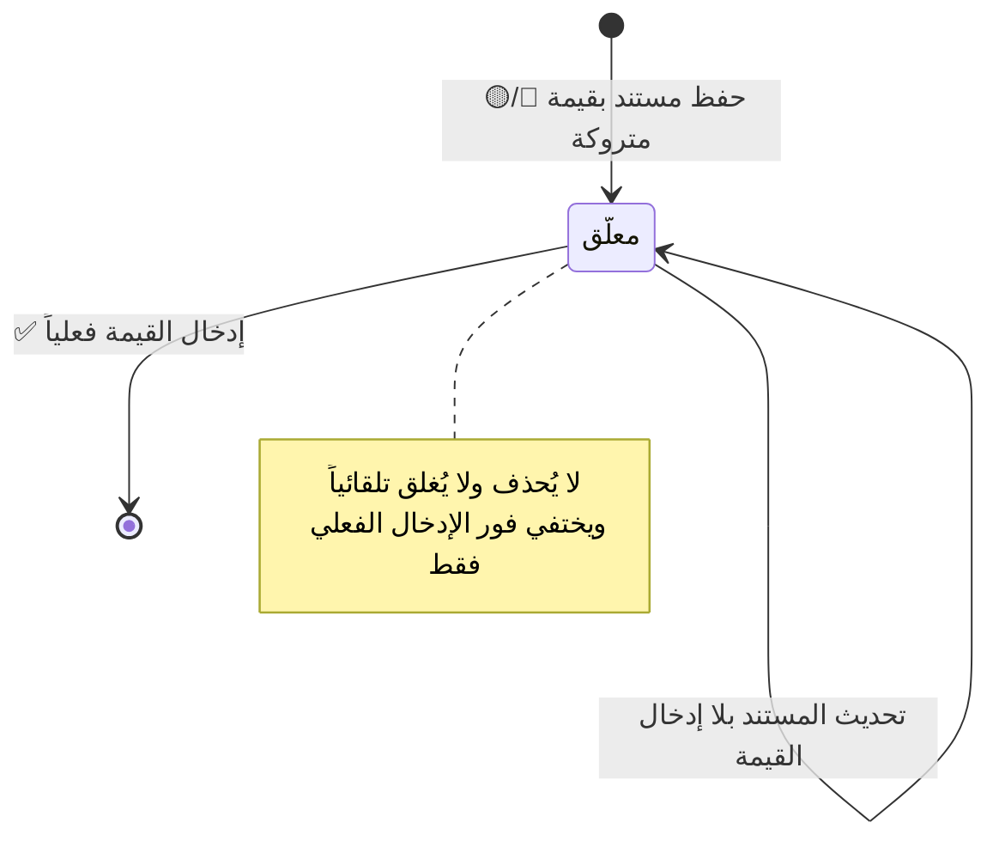

# تصميم وحدة: مركز الإدخالات المعلّقة (`pending-entries`)

| البند | القيمة |
|---|---|
| **الحالة** | **مخطَّط** |
| **الوحدات المغطّاة** | عابرة — `M7` `M9` `M10` `M22` |
| **يعتمد على** | كل الوحدات التي تحوي حقولاً 🔵/🟡 |
| **المتطلبات** | `FR-SYS-01` … `FR-SYS-10` |

---

## 1. المبدأ الحاكم

> **بعض القيم لا تكون معروفة لحظة إنشاء المستند** (ضريبة الكيلو · أنواع
> الجونية · الأسعار · سعر القات المسحوب). فالنظام **يسمح بتأجيلها بحسب
> الصلاحية، لكنه لا ينساها ولا يسمح بضياعها.**
>
> **ودوره الملاحقة والتذكير لا المنع** — **لا يُلزم بالإدخال ولا يُعطِّل
> أي عملية** (`GR-50`).

## 2. التصنيف الثلاثي لكل حقل

| الرمز | المعنى | السلوك |
|---|---|---|
| **🟢 حالي** | يُدخَل إلزامياً لحظة الإنشاء | **لا يُحفظ المستند بدونه** |
| **🟡 لاحق** | يجوز تركه وإدخاله **من نفس المكان** | يُحفظ المستند **ويدخل المركز** |
| **🔵 حالي/لاحق** | **يختار المستخدم بحسب صلاحيته** | من يملك «الآن» يُدخله · وغيره يُترَك له «لاحقاً» |

**والقاعدة العامة لتصنيف أي حقل جديد مستقبلاً:**

| الفئة | التصنيف |
|---|---|
| حقول الهوية والبنية (الاسم · الهاتف · المصدر · النوع · الكمية · الأوزان) | **🟢 حالي** |
| **كل حقل مالي أو سعري** | **🔵 حالي/لاحق** — **جوهر المرونة المطلوبة** |
| الملاحظات والبيانات الوصفية | 🟢 حالي (اختياري) |
| **أسباب التعديل والإلغاء والإتلاف وتجاوز الحد الأدنى** | **🟢 حالي إلزامي مفروض في قاعدة الحماية** |
| تواريخ التوريد والتوزيع والبيع | **⚙️ تلقائي 🔒** |
| تواريخ القبض والخصم والسحبيات | 🟢 حالي + صلاحية تاريخ سابق |
| النواتج الحسابية | 🧮 محسوبة |

## 3. سجل بنود المركز

| الحقل | ملاحظة |
|---|---|
| `documentType` · `documentId` · `documentNumber` | — |
| **`readableTitle`** | «عبد الفتاح - جونية رقم ١» — **يفهمه المستخدم بلا فتح المستند** |
| **`sourceId`** · `stockDate` | **لاحترام النطاق والفلترة** |
| **`missingField`** | القيمة الناقصة بالاسم العربي |
| **`navigationTarget`** | **الشاشة والحقل بالضبط** |

> **البنود تُنشئها وتحذفها السحابة حصراً** — لا يكتبها التطبيق ولا يحذفها
> المستخدم (`§6.5`).

## 4. الدلالات البصرية الخمس الإلزامية

| الموضع | الدلالة |
|---|---|
| **الحقل نفسه** | إطار برتقالي + «⏳ لم يُدخل بعد — اضغط للإدخال» |
| **سطر السجل في القائمة** | **شارة ⏳ برتقالية + عدّاد**: «⏳ 3 قيم ناقصة» |
| **رأس الشاشة** | شريط تنبيه: «⚠️ يوجد {عدد} قيمة لم تُدخل بعد في هذه الشاشة» |
| **لوحة التحكم الرئيسية** | **بطاقة «⏳ الإدخالات المعلّقة»** بالعدد الإجمالي |
| **عند التصدير أو الإقفال** | **تحذير صريح بأسماء المستندات الناقصة قبل المتابعة** |

> **الدلالة ⏳ برتقالية موحّدة في كل النظام** — لا شكل بديل في أي شاشة.

## 5. البنود التي يلاحقها

| الوحدة | القيمة المعلّقة |
|---|---|
| **`M7`** | ضريبة الكيلو · **الأنواع لم تُدخل** · وزن الحبة · سعر التوزيع · الحد الأدنى · **الوزن الضائع لم يُؤكَّد** |
| **`M9`** | نوع **له كمية في مخزون اليوم** بلا سعر توزيع أو بلا حد أدنى — **بما فيه السكرب** |
| **`M10`** | سطر توزيع بلا سعر وحدة |
| **`M22`** | بند «قات» بلا سعر |

## 6. سلوك زر [ إدخال ] — قاعدة حاسمة

> **ينقل المستخدم مباشرةً إلى نفس الحقل داخل شاشته الأصلية** — **لا شاشة
> إدخال بديلة**، حفاظاً على **وحدة مكان الإدخال**.
>
> ⚠️ **بناء شاشة إدخال موحّدة داخل المركز مخالفة تصميمية** — تُنتج مساراً
> ثانياً للكتابة بقواعد تحقق منفصلة تفترق عن الأصلية.

## 7. دورة حياة البند

**وعند اختفاء البند تُطلَق إعادة الاحتساب المرتبطة به:**
سعر الجونية · قيمة الضمار وحالة تسويته · ملخص اليوم.

## 8. الفلاتر

المصدر · التاريخ · نوع المستند — **ويحترم المركز نطاق مصادر المستخدم**.

## 9. الحالات الحدّية

| # | الحالة | المعالجة |
|---|---|---|
| `E-06` | جونية بلا أنواع ولا ضريبة | **ثلاثة بنود** (الضريبة · الأنواع · تسعير السكرب) |
| `E-27` | سحبية بقات بلا سعر | بند «سعر القات المسحوب» · **وسعر الجونية «غير نهائي»** |
| `AT-23` | توزيعة بسطر غير مسعَّر | بند واحد · والحالة «مسعَّر جزئياً» |
| — | نوع سُعِّر من شاشة الجونية | **يختفي بنده فوراً** — المصدران يكتبان نفس الحقل |
| — | نوع نفد رصيده اليوم | **يختفي بند تسعيره** — لا يُطالَب بتسعير ما لا كمية له |

## 10. نقاط الانتباه للمنفِّذ

> ⚠️ **المركز لا يمنع شيئاً.** أي تنفيذ يمنع الحفظ أو التصدير بسبب بند
> معلّق **يخالف `GR-50`** — الغرض **الملاحقة والتذكير**، والتحذير عند
> التصدير **تحذير لا حجب**.

> ⚠️ **البنود مشتقّة لا مصدر حقيقة** — قابلة لإعادة البناء بالكامل من
> المستندات (`PAT-07`).

## 11. الاختبارات المرتبطة

`TC-SYS-001` · `TC-SYS-002` · `AT-16` · `AT-23` · `AT-24` · `AT-41` ·
`E-06` · `E-27` · `R-28`
