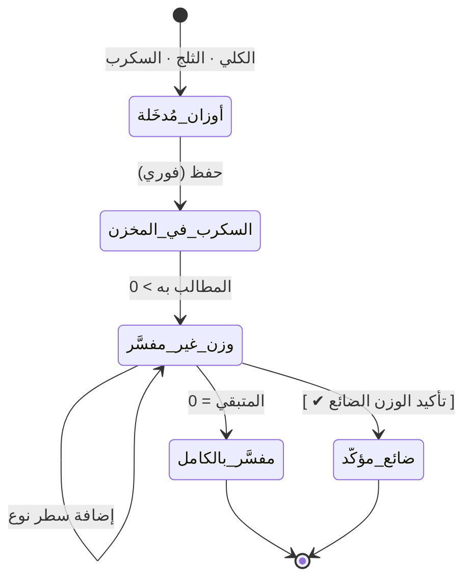

# تصميم وحدة: الوارد جواني (`sack-intake`)

| البند | القيمة |
|---|---|
| **الحالة** | ✅★★ **منفَّذ** — `WU-004` (2026-08-26): **الرأس والأوزان والمطالب به** · **توريد السكرب فوراً** · **جدول وزن الحبة الثلاثي** · **الحاسبة الحيّة وشريط التقدّم** · **تأكيد الوزن الضائع** · **الترقيم اليومي المستقل لكل مصدر** · **الأسماء المركّبة** · **الضريبة في `finance/current`** · **التعديل والإلغاء**. ⛔ **ولم يُنفَّذ بعد:** **سعر الجونية وصافي الرعوي** — `M14` (`WU-015` — المرحلة الثانية) · **نسخ جونية سابقة كقالب** (`FR-M7-29`) |
| **الوحدات المغطّاة** | `M7` |
| **يعتمد على** | `master-data` · `inventory` |
| **المتطلبات** | `FR-M7-01` … `FR-M7-29` |

> **أعقد وحدة في النظام** — وأدقّها صلاحياتٍ (16 صلاحية تفصيلية).

---

## 1. المسؤوليات

1. استلام الجونية بأوزانها · **وتوريد السكرب للمخزن فوراً**.
2. تفصيل الجونية إلى أنواع بثلاث حالات مختلفة لوزن الحبة.
3. **حاسبة الوزن الحيّة** وتأكيد الوزن الضائع.
4. إدخال الضريبة (الآن أو لاحقاً).

## 2. آلة حالة الوزن — جوهر الوحدة

> **الحالة `وزن_غير_مفسَّر` تبقى قائمة ويُلاحقها المركز المعلّق** حتى
> يُفسَّر الوزن بالكامل **أو يُؤكَّد ضائعاً بزر صريح** — **ولا يُسجَّل
> الوزن الضائع ضمناً أبداً** (`BR-M7-12`).

## 3. جدول وزن الحبة — الحالات الثلاث (يُنفَّذ حرفياً)

| حالة النوع | **وزن الحبة** | **الوزن الكلي للسطر** |
|---|---|---|
| **وزني + وزن حبة في التهيئة** | يظهر **تلقائياً** · قابل للتعديل **هنا فقط** ولا يُعدِّل التهيئة | **محسوب** = (العدد × وزن الحبة) ÷ 1000 — **غير قابل للإدخال** |
| **وزني بلا وزن حبة في التهيئة** | **يُدخَل يدوياً** — **ولا يُستنتج من الوزن الكلي إطلاقاً** | **محسوب** كما أعلاه |
| **عددي** | **الحقل مقفل وفارغ** · **يُستنتج** = (الوزن الكلي × 1000) ÷ العدد | **يُدخَل يدوياً** |

> ⚠️ **أكثر موضع معرَّض للخطأ في النظام كله.** الخلط بين الحالتين الثانية
> والثالثة **ينتج أوزاناً خاطئة تُفسِد سعر الجونية وصافي الرعوي معاً**.
> ولذلك **`mustNotInferPieceWeightForWeightBased` قاعدة صريحة مُختبَرة**
> لا افتراض ضمني (`E-08` · `E-09`).

## 4. الكيان

| المجموعة | الحقول |
|---|---|
| **الرأس** | رقم المستند · **`stockDate` (تلقائي مقفل)** · `entryDate` · `sourceId` · `supplierId?` · **`dailySequence` (من السحابة · مستقل لكل مصدر)** · **`displayName`** · `totalWeight` · `iceWeight` · **`scrapWeight`** — ⛔ **بلا أي حقل مالي** |
| **محسوب في الأب** | `claimableWeight` · `remainingWeight` · `lostWeight` · `isPricingComplete` *(حالة لا مبلغ)* |
| 🔒 **المالية** *(`finance/current` — `ADR-0011`)* | `taxPerKilo?` · `sackTax` · **`sackRevenue`** · **`supplierNet`** — محكومة بـ`sackFinanceView` |

> ⛔ **`ADR-0011`:** الحقول المالية **معزولة في مستند فرعي** — وقاعدة الحماية
> **ترفض أياً منها في الأب**. ★ **ومسار إدخال الضريبة المقيَّد صار على المستند
> الفرعي** لا على الجونية.
| **السطر** | `itemId` · `itemName` · **`compositeName`** · `nature` · **`unit`** · `quantity` · `pieceWeightGrams` · **`pieceWeightOrigin`** (تهيئة/يدوي/مستنتج) · `lineTotalWeight` · `distributionPrice?` · `minCashPrice?` |

> **`pieceWeightOrigin` حقل توثيقي مهم** — يجعل مصدر الرقم قابلاً للتدقيق
> لاحقاً، ويكشف أي استنتاج خاطئ لنوع وزني.

## 5. مسارات الكتابة المنفصلة

> **قاعدة الحماية تفرض مساراً منفصلاً لكل مجموعة حقول، ولكل مسار صلاحيته
> المطابقة** (`§6.5` · `§9.6`):

| المسار | الصلاحية |
|---|---|
| الاسم الظاهر | «تعديل اسم الجونية» — **ويمنع مسّ الرقم المتسلسل** |
| الضريبة | «إدخال الضريبة الآن» / «… لاحقاً» |
| السطور | «إدخال أنواع الجونية الآن» / «… لاحقاً» |
| وزن الحبة في السطر | «تعديل وزن الحبة في السطر» |
| الأسعار | «إدخال سعر التوزيع» / «إدخال الحد الأدنى» |
| **وزن السكرب** | «إدخال وزن السكرب» — **ويُولِّد سطر مخزون السكرب تلقائياً** |
| الوزن الضائع | «تأكيد الوزن الضائع» |

### 5.1 ⛔★★★ تعبئةٌ مؤجَّلة ≠ تعديلُ جونية معتمدة (`ADR-0018` · `IQ-025`)

★★ **المساران المؤجَّلان — `enterSackLines` و`enterSackTax` — يملآن حقلاً
تركه `FR-M7` مؤجَّلاً عمداً** (`FR-M7-10` · `FR-M7-12` · `E-06`)
**بمفتاحه «الآن / لاحقاً»**، ⛔ **وليسا مسار «تعديل جونية معتمدة»** — ★ **ذاك
`amendSack` بمفتاح `sackAmend`** (`FR-M7-26` · `AT-58`) ⛔ **ولم يُمَسّ
مفتاحُه.** ⚠️★★ **وسببُه صار اختيارياً بـ`ADR-0020`** — ★ **فالفارق بين
العمودين أدناه صار في الوسم والمفتاح، لا في السبب.**

| | التعبئة المؤجَّلة | تعديل جونية معتمدة |
|---|---|---|
| **المسار** | `enterSackLines` · `enterSackTax` | `amendSack` |
| **المفتاح** | «إدخال … الآن / لاحقاً» | `sackAmend` |
| **السبب النصي** | ★★ **اختياري** | ★★ **اختياري كذلك** — `ADR-0020` (⛔ **كان إلزامياً بـ`ADR-0004` الشرط 2**) |
| **أوّلُ تعبئةٍ على حقلٍ فارغ** | ⛔ **ليست تعديلاً:** لا `amendCount` ولا `amendedBy` ولا `lastAmendedAt` ولا شارة «مُعدَّل» · **وفعلُ القيد `create`** | — |
| **تغييرٌ لاحق** | ★ **تعديلٌ كامل الوسم:** `amendCount` يتراكم **وفعلُ القيد `amend`** ★ **والسبب اختياري** | ★ **تعديلٌ كامل الوسم** ★★ **وسببُه اختياري** (`ADR-0020`) |

⛔⛔★★ **ولا يُعبِّئ التطبيق سبباً نيابةً عن المستخدم في أي منها** — ★ **ما
لم يكتبه إنسانٌ لا يُرسَل ولا يُخزَّن**، ⟵ **فحقلُ `reason` في القيد إمّا
نصُّ إنسانٍ وإمّا غياب** ⛔ **ولا حالةَ ثالثة تُقرأ خطأً.**

## 6. الحالات الحدّية

| # | الحالة | المعالجة |
|---|---|---|
| `E-06` | جونية بأوزان بلا أنواع وبلا ضريبة | **تُحفظ · ويدخل السكرب فوراً** · وثلاثة بنود في المركز |
| `E-07` | مجموع الأوزان > المطالب به | **يُرفَض السطر** برسالة تبيّن المجموع والمطالب به |
| `E-10` | متبقٍ غير مؤكَّد | يبقى «وزن غير مفسَّر» ويُلاحقه المركز |
| `E-43` | جونيتان متزامنتان في نفس المصدر | **الترقيم من السحابة يمنع التكرار** |
| `E-44` | جونيتان في مصدرين نفس اليوم | **كلتاهما «رقم ١»** — تسلسل مستقل لكل مصدر |
| — | الوزن الكلي ≤ الثلج + السكرب | **يُرفَض الحفظ** |
| — | تعديل بالنقص لكمية صُرفت | **يُرفَض** برسالة تذكر الفرق والوحدة |

## 7. نقاط الانتباه للمنفِّذ

> ⚠️ **السكرب يدخل المخزن عند حفظ الرأس — قبل أي نوع آخر.** فمن يؤجّل
> توريده لمرحلة إدخال الأنواع يكسر `AT-07` و`E-06`.

> ⚠️ **الرقم المتسلسل الداخلي لا يُعاد استخدامه ولا يتغيّر أبداً** — حتى لو
> غُيِّر الاسم الظاهر أو أُلغيت الجونية.

> ⚠️ **تعديل وزن الحبة داخل السطر لا يُعدِّل التهيئة** — والقيمة **مُجمَّدة
> داخل السطر** لحظة الحفظ.

## 8. الاختبارات المرتبطة

`TC-M7-001` … `TC-M7-006` · `AT-06` … `AT-15` ·
`E-06` · `E-07` · `E-08` · `E-09` · `E-10` · `E-43` · `E-44`

---

## 9. ★★ ما نُفِّذ فعلاً في `WU-004` — وما بقي معلَناً

| البند | الحالة |
|---|---|
| رأس الجونية بأوزانه الثلاثة والمطالب به (`FR-M7-06`…`08`) | ✅ **منفَّذ** |
| ⚙️ **توريد السكرب فور حفظ الرأس** (`FR-M7-09` · `AT-07` · `E-06`) | ✅ **منفَّذ** — ★ **في معاملة الإنشاء نفسها** |
| **الترقيم اليومي المستقل لكل مصدر** (`FR-M7-04` · `E-43` · `E-44`) | ✅ **منفَّذ** — ★ **عدّادان: `document_counters` و`daily_sack_counters`** |
| **الاسم الظاهر والأسماء المركّبة** (`FR-M7-05` · `FR-M7-16` · `ADR-0007`) | ✅ **منفَّذ** — ★ **والاسم المركّب مفتاحُ الرصيد** |
| ★★★ **جدول وزن الحبة الثلاثي** (`FR-M7-13` · `FR-M7-14` · `E-08` · `E-09`) | ✅ **منفَّذ** — ★ **و`pieceWeightOrigin` مخزَّن بحالاته الثلاث فعلاً** (`DEBT-37` · ⛅ **مُثبَتٌ حيّاً**) ⛔ **بعد أن كانت «تهيئة» غيرَ قابلةٍ للكتابة إطلاقاً** |
| **الحاسبة الحيّة وشريط التقدّم** (`FR-M7-17` · `FR-M7-29`) | ✅ **منفَّذ** — ★ **بدالةٍ واحدة يشاركها التطبيق والسحابة** |
| **تأكيد الوزن الضائع الصريح** (`FR-M7-19` · `FR-M7-20` · `BR-M7-12`) | ✅ **منفَّذ** — ★ **بفعلٍ مستقل في سجل التدقيق** (`lostWeightConfirm`) |
| **الضريبة وحسابها المقرَّب** (`FR-M7-10` · `FR-M7-11`) | ✅ **منفَّذ** — 🔒 **في `finance/current`** (`ADR-0011`) |
| **مسارات الكتابة المنفصلة السبعة** (`FR-M7-27` · `§9.6`) | ✅ **منفَّذ** — ★ **ولكلٍّ صلاحيته وقناعُه الضيّق** |
| **التعديل والإلغاء** (`FR-M7-26`) | ✅ **منفَّذ** — ★ **على الحركة نفسها بلا حركة عكسية** |
| ⛔ **سعر الجونية وصافي الرعوي** (`FR-M7-24` · `FR-M7-25`) | ⛔ **لم يُنفَّذ** — **`M14`** (`WU-015` — المرحلة الثانية) |
| ⛔ **سعر التوزيع والحد الأدنى من `M9`** (`FR-M7-21`) | ⚠️ **جزئي** — ★ **الحقلان يُكتبان في السطر**، ⛔ **والمزامنة مع `M9` في `WU-005`/`WU-006`** |
| ⛔ **نسخ جونية سابقة كقالب** (`FR-M7-29`) | ⛔ **لم يُنفَّذ** — **ميزة مساعدة**، ★ **ولا يعتمد عليها أي متطلب آخر** |
| ⛔ **بنود المركز المعلّق** (`FR-M7-10` · `E-06` · `E-10`) | ⛔ **لم يُنفَّذ** — **`FR-SYS`** (`WU-009`) · ★ **والحالة مخزَّنة فيه أصلاً** (`remainingWeight` · `lostWeightConfirmed` · `taxPerKilo`) |

> ⚠️⚠️ **وحدٌّ معلَن لا يُطوى — `FR-M7-22` «الإضافة السريعة أخرى»:**
> ⛔ **لم تُنفَّذ**، ★ **وقائمة الأنواع تُفلتَر بالمصدر حصراً كما يفرض
> المتطلب** — ⟵ **والنوع الجديد يُضاف من شاشة الأنواع** (`M5`)، ⛔ **ولا
> مسار مختصر له من هنا بعد.**

## 10. ★★ ما غيّره `AM-009` ④ في ورقة أنواع الجونية (2026-08-31)

★★★ **الشكلُ وحده تغيّر — والمنطقُ لم يُمَسّ بحرف:**

- ⛔⛔ **كانت الورقة تعرض *كلَّ* أنواع المصدر صفوفاً بمربّعِ اختيارٍ لكلٍّ** —
  ⟵ **فتطول بطول الكتالوج**، ★ **والمستخدم يمرّ أربعين نوعاً ليؤشّر ثلاثة.**
- ✅ **وصارت صفّاً يُنشأ بالطلب** (`QtmsItemLineRow` · `design-system.md` §6-ب).
- ⛔⛔★★★ **وجدولُ وزن الحبة الثلاثي كما هو حرفياً** (`FR-M7-13` · `E-08` ·
  `E-09`): ★ **العدديُّ بلا حقل وزن حبةٍ إطلاقاً — والقفلُ غيابُ الحقل لا
  تعطيلُه** · ★ **والوزنيُّ بوزن حبةٍ من التهيئة أو يدوي.**
- ★★ **وتبديلُ نوعِ الصفّ يُعيد بناء مسوّدته** — ⟵ **فوزنُ الحبة المُهيَّأ
  يخصّ نوعَه**، ⛔ **ولا يُورَّث من نوعٍ إلى آخر** (`FR-M7-15`).
- ⛔ **ولا رصيدَ متبقٍّ في خيارات هذه الورقة** — ★ **الجونيةُ *تُورِد* لا
  تصرف**، ⟵ **والمتبقّي شأنُ شاشات الصرف** (`FR-M10-06`).
- ⛔⛔ **وتأكيدُ الوزن الضائع يبقى زرّاً صريحاً مستقلاً** (`FR-M7-19` ·
  `BR-M7-12`) — ★ **ولا يُسجَّل ضمناً مع الحفظ.**

