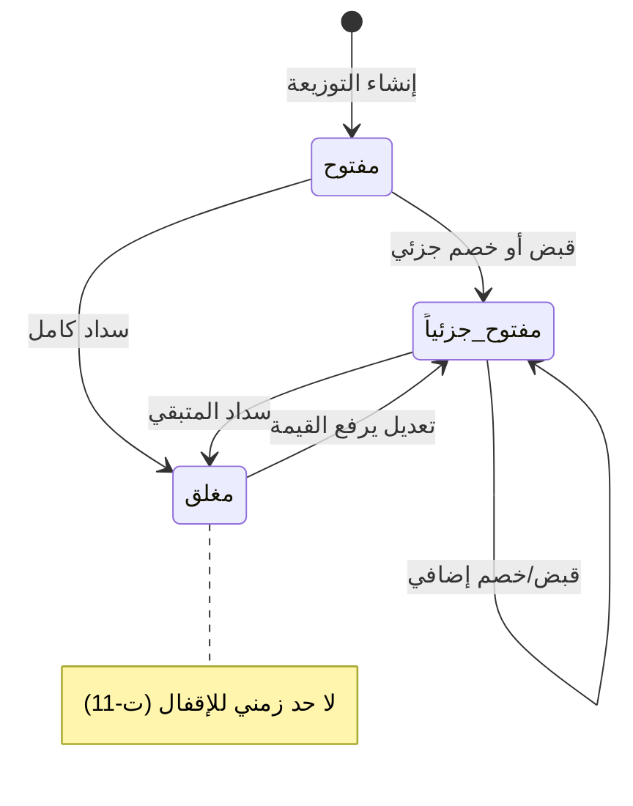

# تصميم وحدة: التسوية (`settlement`)

| البند | القيمة |
|---|---|
| **الحالة** | ⏳ **منفَّذ جزئياً** (2026-09-01) — ✅ **`M12` المقبوضات والفائض والإيداع البنكي وحساب المقوت** (`WU-007`) · ⏳★★ **و`M13` الخصومات مبنيّةٌ كاملةً ومُختبَرةٌ آلياً** (`WU-013` — **85 اختباراً**) ⛔ **وغيرُ مُثبَتةٍ حيّاً**: ★ **مساراتُها الثلاثة تردّ `404` حتى يُنشَر الإصدار** · ⛔ **و`M17` كشف الحساب** (`WU-017`) **لم يُنفَّذ بعد** |
| **الوحدات المغطّاة** | `M12` المقبوضات · `M13` الخصومات · `M17` كشف حساب المقوت |
| **يعتمد على** | `distribution` (الضمارات) · `master-data` |
| **المتطلبات** | `FR-M12-*` · `FR-M13-*` · `FR-M17-*` |

---

## 1. المسؤوليات

1. تسجيل المقبوضات وتوزيعها على الضمارات · **وإدارة المبلغ الفائض**.
2. تسجيل الخصومات (إسقاط دين بلا نقد).
3. **متابعة الإيداع البنكي**.
4. بناء كشف حساب المقوت من الدفتر.

## 2. دفتر حسابات المقاوته

| الحقل | ملاحظة |
|---|---|
| `dealerId` · `dealerName` | — |
| **`sourceId`** | **إلزامي — الحساب مرتبط بالمصدر** |
| **`debtLotId?`** | الضمار المتأثر |
| `direction` | مدين (عليه) / دائن (له) |
| `amount` · `balanceAfter` | الرصيد **في هذا المصدر** |
| **`entryType`** | ضمار · قبض · خصم · **تطبيق فائض** |
| `sourceDocType` · `sourceDocId` · `sourceDocNumber` | — |
| `entryDate` · `memo` | — |
| **`isCancelled`** · `lastAmendedAt` · `amendedBy` · `amendReason` | — |

## 3. آلة حالة الضمار



```text
المتبقي على الضمار = قيمة الضمار − المسدَّد − المخصوم
```

## 4. المبلغ الفائض — الأدق في هذه الوحدة

```text
المقوت عليه 30,000 ودفع 50,000
   ↓ يوزَّع 30,000 على الضمارات المفتوحة
   ↓ يُدخل المستخدم 20,000 في «مبلغ إضافي (فائض)»
   ✅ يُسجَّل 20,000 «فائض متاح» بتاريخ هذا السند
   ↓ عند إنشاء ضمار جديد للمقوت:
   ⚙️ تسدد السحابة تلقائياً من الفائض
   ⚙️ وتكتب البيان الآلي:
      «تسديد تلقائي من المبلغ المدفوع بتاريخ {تاريخ إدخال الفائض}»
   ↓ وإن بقي فائض يُسدَّد للضمار الذي يليه وهكذا
```

| نطاق الفائض | السلوك |
|---|---|
| **مصدر محدد** | يُقيَّد في حساب المقوت **في ذلك المصدر فقط**، ويُسدَّد **لضماراته حصراً** |
| **«الكل»** | يُقيَّد **فائضاً عاماً**، ويُسدَّد **لأي ضمار قادم بأي مصدر بالأقدم أولاً** |

> **مفتاح الفائض:** `{dealerId}_{sourceId | 'general'}`.

## 5. التوزيع التلقائي

| البند | القاعدة |
|---|---|
| **الحساب** | **محلي في التطبيق بلا أي كتابة** |
| **الترتيب** | **بالأقدم أولاً** — يسدد كلاً بالكامل حتى ينفد المبلغ، والأخير جزئياً |
| **الفائض** | ما يزيد يُسجَّل في حقل الفائض |
| **الحاسم** | **تُعرَض النتيجة للمراجعة والتعديل قبل الحفظ ولا تُحفظ تلقائياً** |
| **الطبيعة** | **ميزة اختيارية** — التوزيع اليدوي متاح دائماً |

## 6. الإيداع البنكي — **صلاحيتان منفصلتان**

| البند | القاعدة |
|---|---|
| الحالة | تبدأ **«لم يُودع»** · وتُغيَّر بزر مستقل |
| **رؤية الحالة** | تتطلب **«عرض حالة الإيداع البنكي»** — ومن لا يملكها **لا يرى العمود ولا الفلتر إطلاقاً** |
| **تأكيد الإيداع** | يتطلب **«تأكيد الإيداع البنكي»** **+ ملاحظة إلزامية** |
| **التراجع** | نفس الصلاحية · **ويُسجَّل قيداً مستقلاً بالقيمة قبل وبعد** |
| **مسار الكتابة** | **منفصل يقتصر على حقول الإيداع** ويشترط ملاحظة غير فارغة |

## 7. الفرق الملزم بين `M12` و`M13`

> ✅★★★ **مُنفَّذٌ في `WU-013` بأربعة فوارق بنيوية لا شرطٍ يُفحَص** — ★ **وكلُّ
> واحدٍ منها موضعٌ مستقل**: ① **مجموعةٌ منفصلة `discounts`** ·
> ② **صلاحيةٌ منفصلة `discountCreate`** (⛔ **لا تُمنَح افتراضياً** —
> `FR-M13-09`) · ③ **نوعُ قيدٍ منفصل `DealerLedgerEntryType.discount`**
> (⟵ **فشاشةُ حركة النقد تُفرِّق**) · ④ **نوعُ تدقيقٍ منفصل
> `discountEntityType`** (⟵ **فسجلُّ التدقيق نفسُه يُفرِّق**).
> ⛔⛔ **والفائضُ غائبٌ من النوع والمخطَّط والشاشة والحمولة معاً** —
> ★ **ويُرفَض صراحةً لو أُرسل** (`ERR_DIST_009`).

| البند | المقبوضات | **الخصومات** |
|---|---|---|
| الأثر النقدي | ✅ نقد دخل | **❌ إسقاط دين بلا نقد** |
| **الفائض** | ✅ | **❌ غير موجود إطلاقاً — وترفضه قاعدة الحماية** |
| **الإيداع البنكي** | ✅ | **❌ لا ينطبق** |
| في بطاقة ضمار المالك | ضمن **الواصل** | **بند مستقل** |
| في حركة النقد | **يُطرح** | **لا يُطرح** — يُعرض للعلم |

## 8. التمييز الحاكم (`GR-41`)

```text
«الواصل»            = ما سُدِّد من ضمارات ذلك اليوم
                      مهما كان تاريخ سند القبض
«المقبوض في تاريخ» = كل ما دخل الصندوق فعلاً في ذلك التاريخ
                      مهما كان تاريخ الضمار المسدَّد
```

> ⚠️ **رقمان مختلفان لا يجوز الخلط بينهما.** الأول **ذمة يوم**، والثاني
> **صندوق يوم** — ولكل منهما شاشته وحسابه.

## 9. كشف الحساب (`M17`)

- **يُبنى من الدفتر حصراً لا من أرقام مخزَّنة.**
- **الفصل بالمصدر إلزامي**؛ وعرض «الكل» يعرضها **مجمّعة مع بيان كل مصدر
  بوضوح** ولا يُنشئ رصيداً موحّداً.
- **شارة «مُعدَّل»** أمام أي حركة عُدِّلت — **لأن الحركة تُعدَّل في مكانها
  فلا يظهر لها سطر مضاد**.
- **الملغاة تُستبعَد من الأرصدة** ويجوز إظهارها **مشطوبة** بخيار.
- التذييل: الرصيد **رقماً وكتابةً بالعربية** · الفائض المتاح · تنبيه السطور
  غير المسعَّرة (**لا تدخل الرصيد**) · **أعمار الدين بالضمارات**.

## 10. الحالات الحدّية

| # | الحالة | المعالجة |
|---|---|---|
| `E-11` | دفع أكثر من المستحق | فائض متاح ⟵ يُسدَّد تلقائياً ببيان آلي |
| `E-12` | فائض بلا سطر مع ديون مفتوحة | **مسموح مع تنبيه صريح** يقترح التوزيع التلقائي |
| `E-13` | فائض مصدر وضمار مصدر آخر | **لا يُسدَّد** |
| `E-14` | قبض بتاريخ سابق | مسموح بصلاحية · ويظهر في «المقبوض» **بتاريخ السند** |
| `E-35` | نطاق مصدر واحد | **لا يرى إلا ضمارات مصادره** |
| — | تاريخ مستقبلي | **مرفوض دائماً بلا استثناء** |

## 11. نقاط الانتباه للمنفِّذ

> ⚠️ **حركة دائنة لكل سطر لا حركة واحدة مجمّعة** — لأن كل سطر يخص ضماراً
> ومصدراً مختلفاً.

> ⚠️ **تطبيق الفائض عملية سحابية لا تطبيقية** — لأنها تُطلَق عند **إنشاء
> ضمار جديد** لا عند القبض.

## 12. الاختبارات المرتبطة

`TC-M12-001` … `TC-M12-006` · `TC-M13-*` · `TC-M17-*` ·
`AT-29` … `AT-37` · `AT-49` · `E-11` … `E-14`
