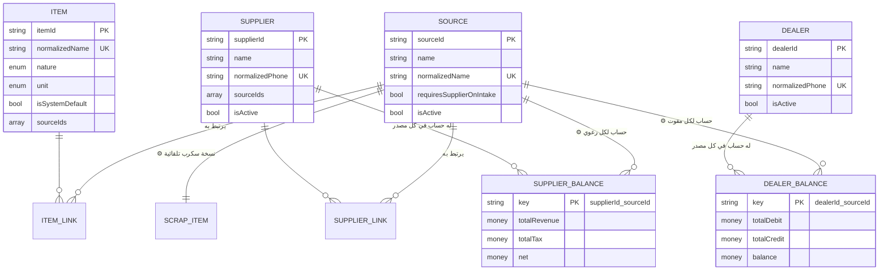
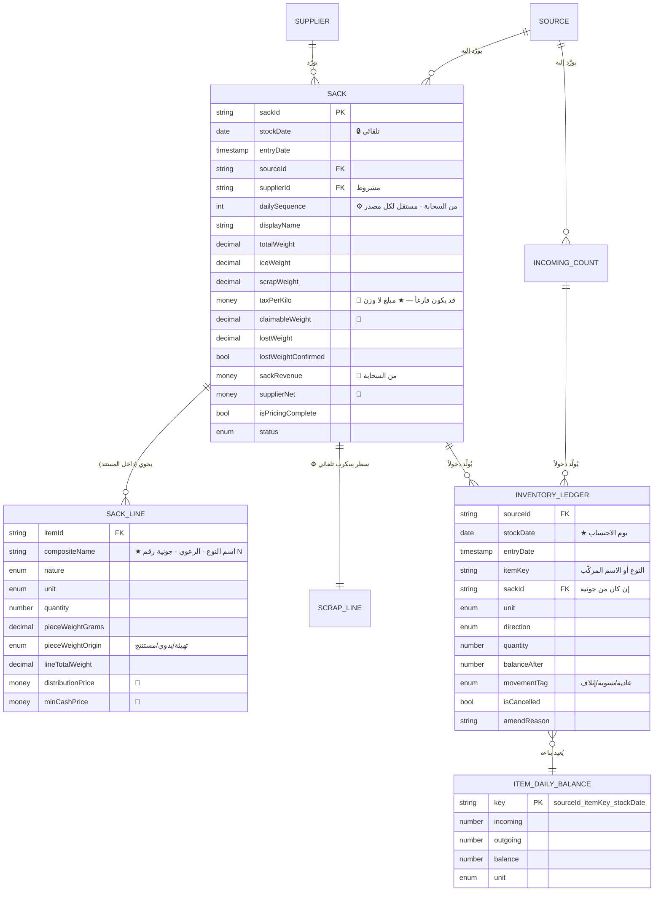
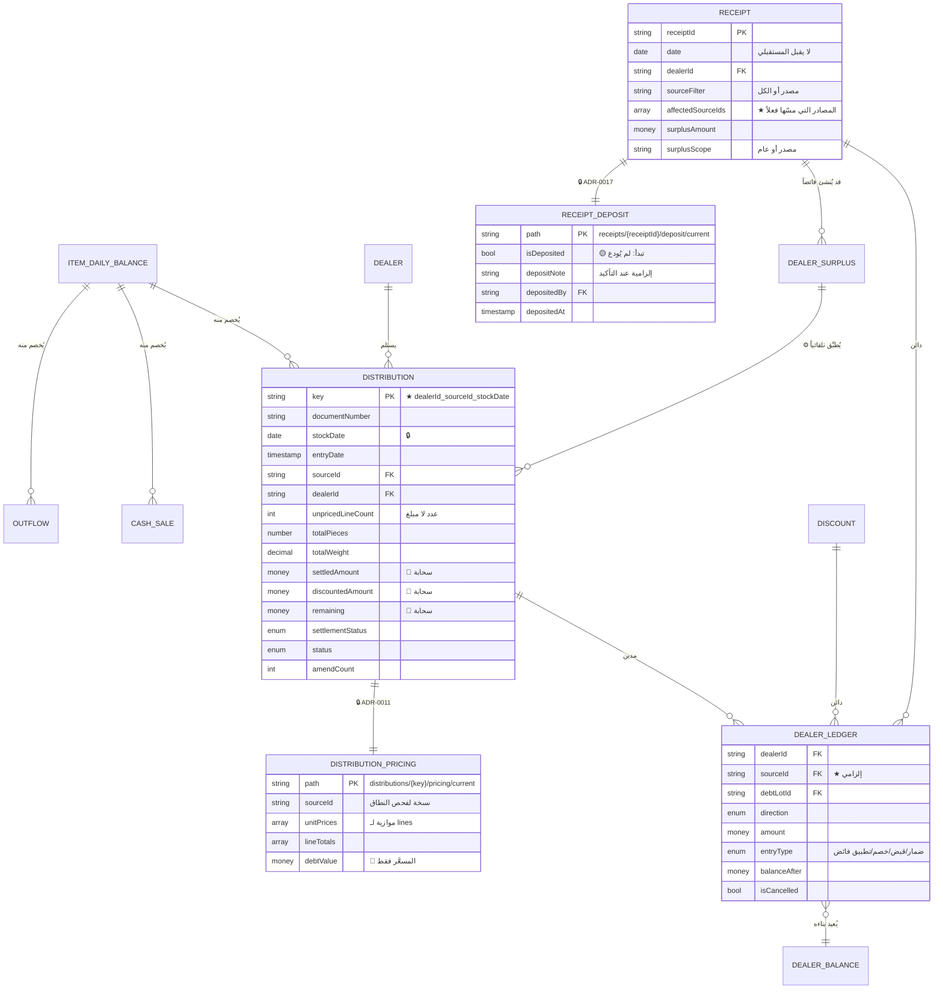
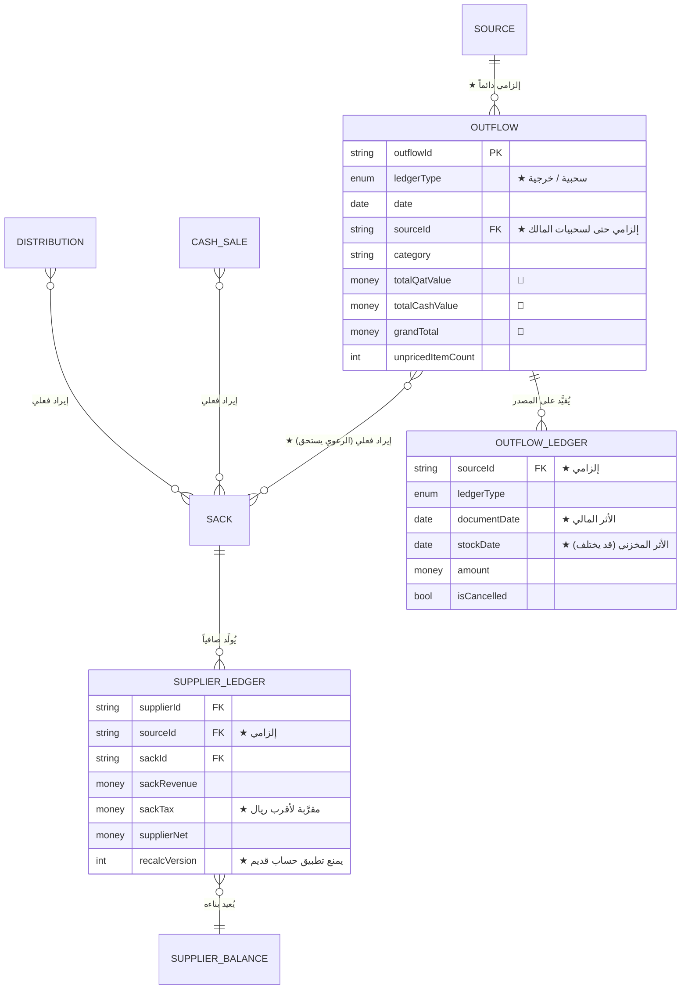
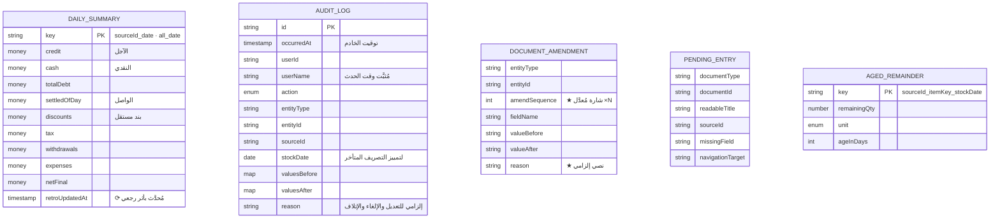

# مخطط العلاقات بين الكيانات (ERD) — QTMS

| البند | القيمة |
|---|---|
| **الإلزامية** | **M** — **يُقرأ إلزامياً قبل أي تعديل بنيوي** |
| **الطبيعة** | **LIVING** — يُحدَّث بعد كل تغيير بنيوي |
| **المالك** | ARCH / DEV |

> ★ **دليل الأنواع في المخططات أدناه:**
> **`money`** = ★ **عدد صحيح بالريال (`int` 64 بتّة)** ⛔ **بلا كسور ولا
> تخزين بأصغر وحدة** (`ADR-0015`) · **`decimal`** = **وزن** بثلاث خانات
> للكيلوجرام وخانتين للجرام — ★ **وهو ليس مبلغاً فلا يسري عليه القيد** ·
> **`int`** = عدد صحيح غير مالي (كميات معدودة · عدّادات).
>
> ⚠️ **استثناء يجب الانتباه له:** ★ **`taxPerKilo` مبلغ لا وزن** — فنوعه
> **`money`** رغم اقترانه بالكيلوجرام (`ADR-0015` · `glossary.md`).

> ⚠️ **تنبيه على طبيعة القاعدة:** هذه **قاعدة مستندية لا علائقية** —
> **فالعلاقات أدناه منطقية لا مفروضة بقيود مفتاح أجنبي**. السلامة المرجعية
> **مسؤولية التصميم والعمليات السحابية** لا القاعدة.

---

## 1. الكيانات المرجعية والعلاقات المشتقّة

> **`DEALER` و`SUPPLIER` لا يحملان حقل مصدر إطلاقاً** — حساباتهما **سجلات
> مستقلة** مفتاحها مركّب. **وإضافة حقل مصدر للمقوت خطأ بنيوي يهدم `ADR-0005`.**

## 2. التوريد والمخزون

## 3. الصرف والذمم

## 4. الجونية والرعوي والسحبيات

> ⚠️ **`OUTFLOW` لا يرتبط بـ`DEALER` إطلاقاً** — لا مدين ولا دائن ولا ضمار
> (`GR-44`). **وأي علاقة بينهما خطأ بنيوي.**

## 5. الملخصات والرقابة

## 6. قواعد العلاقات الملزمة

| # | القاعدة | المرجع |
|---|---|---|
| 1 | **كل مستند تشغيلي يحمل `sourceId` صراحةً** | `GR-20` |
| 2 | **كل حركة مخزون تحمل `stockDate` و`entryDate` معاً** | `GR-13` |
| 3 | **حساب المقوت والرعوي مفتاحه مركّب بالمصدر** | `GR-21` |
| 4 | **`{dealerId}_{sourceId}_{stockDate}` يفرض توزيعة واحدة** | `GR-18` |
| 5 | **أنواع الجونية تدخل المخزون بالاسم المركّب** — والوارد عدداً بالاسم المجرَّد | `GR-24` · `BR-M6-10` |
| 6 | **السحبيات والخرجيات لا تمسّ `dealer_ledger` إطلاقاً** | `GR-44` |
| 7 | **الأسماء مكرَّرة عمداً داخل السطور** — ولا تتغيّر تاريخياً | `§6.1` |
| 8 | **الأرصدة والملخصات مشتقّات** قابلة لإعادة البناء من الدفاتر | `ADR-0008` |
| 9 | **`recalcVersion` يمنع تطبيق حساب قديم فوق أحدث** | `sack-valuation-design` |
| 10 | **غياب سجل الرصيد يعني صفراً** — لا يُنشَأ سجل بصفر بلا داعٍ | `§6.3` |

## 7. الحفاظ على التزامن مع الكود

> **هذا المخطط `LIVING` ويُحدَّث بعد كل تغيير بنيوي** — ولا يُدمَج أي تغيير
> يمسّ البنية دون تحديثه **ضمن نفس الدمج** (Docs as Code · UPDS-03 §6).
